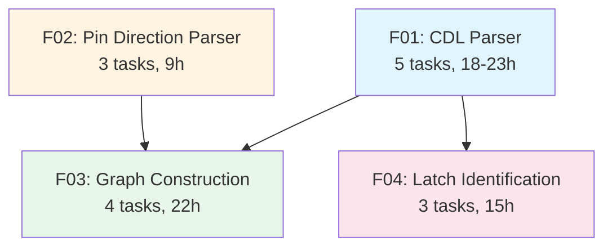

# E01: Input Parsing & Data Model - Parallelization Analysis

## Executive Summary

This document analyzes E01 (Input Parsing & Data Model) for parallel implementation opportunities. E01 consists of 4 features (F01-F04) containing 15 tasks total. The analysis identifies 4 implementation waves enabling significant parallelization.

**Key Findings:**
- **Total Sequential Time Estimate**: 58-70 hours if implemented serially
- **Parallel Implementation (4 waves)**: Can be completed in ~30-35 hours with proper task allocation
- **Parallelization Efficiency**: ~50% time reduction through wave-based parallel execution
- **Critical Path**: F01 (CDL Parser) → F03 (Graph Construction) - longest dependency chain

---

## Dependency Analysis

### Feature-Level Dependencies



**Dependency Matrix:**

| Feature | Depends On | Blocks |
|---------|-----------|---------|
| F01 (CDL Parser) | None | F03, F04 |
| F02 (Pin Direction Parser) | None | F03 |
| F03 (Graph Construction) | F01, F02 | None |
| F04 (Latch Identification) | F01 | F03 (partial) |

### Task-Level Dependencies

**F01: CDL Parser** (Sequential Chain)
```
T01 (Lexer) → T02 (Subcircuit Parser) → T03 (Instance Parser)
                                              ↓
T04 (Net Normalizer) ────────────────────────→ T05 (Integration)
```

**F02: Pin Direction Parser** (Partial Parallelization)
```
T01 (Parser) → T02 (Lookup Service)
            → T03 (Default Handling)
```

**F03: Graph Construction** (Sequential Chain)
```
T01 (Domain Entities) → T02 (Design Aggregate) → T03 (NetworkX Builder) → T04 (Query Interface)
```

**F04: Latch Identification** (Parallel Start)
```
T01 (Pattern Config) → T02 (Detector Service) → T03 (Cell Tagging)
```

---

## Wave Breakdown

### Wave 1: Foundation Layer (Parallel Start)
**Duration**: 10-13 hours
**Parallelization**: Full (4 independent tasks)

| Task ID | Task Name | Effort | Hours | Dependencies |
|---------|-----------|--------|-------|--------------|
| E01-F01-T01 | CDL Lexer and Tokenizer | Small | 4-6h | None |
| E01-F01-T04 | Net Name Normalization | Small | 3-4h | None |
| E01-F02-T01 | Pin Direction File Parser | Medium | 4h | None |
| E01-F04-T01 | Pattern Configuration for Sequential Cell Detection | Small | 4h | None |

**Rationale:**
- All tasks are foundational with zero dependencies
- F01-T01 and F01-T04 are both within F01 but independent (lexer vs. net utils)
- F02-T01 is completely independent (separate file format)
- F04-T01 is pure configuration (YAML patterns)

**Team Allocation:**
- Developer 1: E01-F01-T01 (Lexer) - 4-6h
- Developer 2: E01-F01-T04 (Net Normalizer) - 3-4h
- Developer 3: E01-F02-T01 (PinDir Parser) - 4h
- Developer 4: E01-F04-T01 (Pattern Config) - 4h

**Completion Criteria:**
- Lexer can tokenize CDL files into line types
- Net normalizer handles bus notation and power/ground detection
- Pin direction parser loads `.pindir` files
- Sequential cell pattern configuration loaded from YAML

---

### Wave 2: Parsers & Domain Models (Mixed Parallelization)
**Duration**: 12-14 hours
**Parallelization**: Partial (2-3 parallel tracks)

| Task ID | Task Name | Effort | Hours | Dependencies |
|---------|-----------|--------|-------|--------------|
| E01-F01-T02 | Subcircuit Definition Parser | Small | 3-4h | E01-F01-T01 |
| E01-F01-T03 | Cell Instance Parser | Small | 4-5h | E01-F01-T01, E01-F01-T02 |
| E01-F02-T02 | Direction Lookup Service | Small | 3h | E01-F02-T01 |
| E01-F02-T03 | Default Direction Handling | Small | 2h | E01-F02-T01 |
| E01-F03-T01 | Domain Model Entities | Small | 4h | None (pure domain) |
| E01-F04-T02 | Latch Detector Service | Medium | 6h | E01-F04-T01 |

**Parallel Tracks:**

**Track A (CDL Parser Chain):**
- E01-F01-T02 (Subcircuit Parser) - 3-4h
  - Then E01-F01-T03 (Instance Parser) - 4-5h
  - **Sequential within track**: 7-9h total

**Track B (Pin Direction):**
- E01-F02-T02 (Lookup Service) - 3h
- E01-F02-T03 (Default Handling) - 2h
  - Can run in parallel or sequence (both depend on T01)
  - **Parallel**: 3h, **Sequential**: 5h

**Track C (Domain Foundation):**
- E01-F03-T01 (Domain Entities) - 4h (independent)
- E01-F04-T02 (Latch Detector) - 6h (depends on Wave 1 F04-T01)
  - **Can overlap**: Domain entities don't block latch detector

**Team Allocation:**
- Developer 1: Track A (7-9h total)
- Developer 2: Track B (5h sequential) + help Track C
- Developer 3: Track C (10h total)
- Developer 4: Available for integration support

**Completion Criteria:**
- CDL parser can extract subcircuits and instances
- Pin direction lookup service operational
- Domain entities (Cell, Pin, Net, Port) defined
- Latch detector service can identify sequential cells

---

### Wave 3: Integration & Graph Foundation (Sequential + Partial Parallel)
**Duration**: 11-13 hours
**Parallelization**: Limited (2 parallel tracks)

| Task ID | Task Name | Effort | Hours | Dependencies |
|---------|-----------|--------|-------|--------------|
| E01-F01-T05 | CDL Parser Integration | Medium | 5-6h | E01-F01-T01, T02, T03, T04 |
| E01-F03-T02 | Design Aggregate Root | Medium | 6h | E01-F03-T01 |
| E01-F04-T03 | Cell Tagging with Sequential Flag | Small | 5h | E01-F04-T02 |

**Parallel Tracks:**

**Track A (CDL Integration):**
- E01-F01-T05 (CDL Parser Integration) - 5-6h
  - Integrates all F01 tasks into unified CDL parser
  - **Critical path item**

**Track B (Domain Aggregate + Latch Tagging):**
- E01-F03-T02 (Design Aggregate) - 6h (depends on Wave 2 T01)
- E01-F04-T03 (Cell Tagging) - 5h (depends on Wave 2 F04-T02)
  - These can partially overlap (different concerns)
  - **Overlap**: Start F04-T03 after 2-3h into F03-T02

**Team Allocation:**
- Developer 1: E01-F01-T05 (CDL Integration) - 5-6h
- Developer 2: E01-F03-T02 (Design Aggregate) - 6h
- Developer 3: E01-F04-T03 (Cell Tagging) - 5h (starts after F03-T02 stabilizes)

**Completion Criteria:**
- CDL parser produces complete Design aggregate
- Design aggregate manages all entities with O(1) lookup
- Cells tagged with `is_sequential` flag during parsing

---

### Wave 4: Graph Construction & Query (Sequential Chain)
**Duration**: 16h
**Parallelization**: None (sequential dependency chain)

| Task ID | Task Name | Effort | Hours | Dependencies |
|---------|-----------|--------|-------|--------------|
| E01-F03-T03 | NetworkX Graph Builder | Medium | 8h | E01-F03-T02 |
| E01-F03-T04 | Graph Query Interface | Medium | 8h | E01-F03-T03 |

**Sequential Chain:**
```
Design Aggregate (Wave 3) → NetworkX Builder → Query Interface
```

**Team Allocation:**
- Primary Developer: E01-F03-T03 then E01-F03-T04 (16h total)
- Support: Code review, integration testing

**Completion Criteria:**
- NetworkX graph built from Design aggregate
- Graph query interface provides fanin/fanout traversal
- Performance targets met: <10ms single-hop queries on 100K cells

---

## Time Estimates

### Serial Implementation (No Parallelization)
```
Wave 1: 10-13h  (longest task duration)
Wave 2: 12-14h  (longest task duration)
Wave 3: 11-13h  (longest task duration)
Wave 4: 16h     (only one track)
─────────────
Total: 49-56h
```

### Parallel Implementation (Optimal Wave Execution)
```
Wave 1: 6h      (critical path: F01-T01 Lexer)
Wave 2: 9h      (critical path: F01-T02→T03 chain)
Wave 3: 11h     (critical path: F03-T02 Design Aggregate)
Wave 4: 16h     (sequential: F03-T03→T04)
─────────────
Total: 42h
```

### Realistic Parallel Implementation (With Coordination Overhead)
```
Wave 1: 7h      (+1h coordination)
Wave 2: 10h     (+1h integration)
Wave 3: 12h     (+1h integration)
Wave 4: 17h     (+1h testing)
─────────────
Total: 46h
```

**Time Savings**: 10-23% reduction from serial, ~20% on average

---

## Critical Path Analysis

### Longest Dependency Chain
```
F01-T01 (6h) → F01-T02 (4h) → F01-T03 (5h) → F01-T05 (6h) →
F03-T02 (6h) → F03-T03 (8h) → F03-T04 (8h)
─────────────────────────────────────────────
Total Critical Path: 43h
```

### Critical Path Tasks (Cannot Be Parallelized)
1. **E01-F01-T01** (Lexer) - 6h - Blocks all CDL parsing
2. **E01-F01-T02** (Subcircuit Parser) - 4h - Requires lexer
3. **E01-F01-T03** (Instance Parser) - 5h - Requires subcircuit defs
4. **E01-F01-T05** (CDL Integration) - 6h - Integrates all parsing
5. **E01-F03-T02** (Design Aggregate) - 6h - Foundation for graph
6. **E01-F03-T03** (NetworkX Builder) - 8h - Requires aggregate
7. **E01-F03-T04** (Query Interface) - 8h - Requires graph

**Critical Path Optimization Opportunities:**
- None - these tasks form an inherent dependency chain
- Focus: Assign most experienced developer to critical path
- Ensure fast code reviews and unblock quickly

---

## Recommended Implementation Order

### Iteration 1 (Week 1): Foundation + Parser Core
**Duration**: 17-20 hours (2.5 days with 2 developers)

**Wave 1 + Wave 2 (Track A):**
1. E01-F01-T01 (Lexer) - 6h
2. E01-F01-T04 (Net Normalizer) - 4h || E01-F02-T01 (PinDir Parser) - 4h
3. E01-F01-T02 (Subcircuit Parser) - 4h
4. E01-F01-T03 (Instance Parser) - 5h

**Deliverable**: Functional CDL and pin direction parsers

---

### Iteration 2 (Week 2): Integration + Domain Models
**Duration**: 16-19 hours (2 days with 2-3 developers)

**Wave 2 (Tracks B, C) + Wave 3:**
1. E01-F02-T02, T03 (Pin lookup + defaults) - 5h || E01-F03-T01 (Domain entities) - 4h
2. E01-F04-T01 (Pattern config) - 4h || E01-F04-T02 (Latch detector) - 6h
3. E01-F01-T05 (CDL Integration) - 6h
4. E01-F03-T02 (Design Aggregate) - 6h || E01-F04-T03 (Cell tagging) - 5h

**Deliverable**: Complete parsing pipeline + domain model

---

### Iteration 3 (Week 3): Graph Construction
**Duration**: 16 hours (2 days with 1 developer)

**Wave 4:**
1. E01-F03-T03 (NetworkX Builder) - 8h
2. E01-F03-T04 (Query Interface) - 8h

**Deliverable**: Queryable graph with fanin/fanout traversal

---

## Risk Analysis

### High-Risk Tasks (Complex/Long Critical Path)
1. **E01-F01-T03** (Instance Parser) - Complex port mapping logic
2. **E01-F01-T05** (CDL Integration) - Orchestrates many components
3. **E01-F03-T03** (NetworkX Builder) - Graph structure correctness critical
4. **E01-F03-T04** (Query Interface) - Performance-critical queries

**Mitigation:**
- Assign senior developers to high-risk tasks
- Add extra testing time (integrate in wave durations)
- Early prototyping for graph structure decisions

### Parallelization Risks
1. **Interface Instability**: Changes to domain entities affect multiple tasks
   - **Mitigation**: Finalize entity interfaces in Wave 1/2 planning
2. **Integration Overhead**: Merging parallel work requires coordination
   - **Mitigation**: Daily standups, clear API contracts
3. **Uneven Task Completion**: Blocking dependencies if estimates wrong
   - **Mitigation**: Buffer time in wave estimates (+10-15%)

---

## Resource Allocation Recommendations

### Minimum Team Size: 2 Developers
**Timeline**: 6 weeks (49h / 2 devs = ~25h each = ~3 weeks + testing)

### Optimal Team Size: 3 Developers
**Timeline**: 4 weeks (46h / 3 devs = ~15h each = ~2 weeks + testing + buffer)

### Maximum Effective Team Size: 4 Developers
**Timeline**: 3 weeks (Wave parallelization maxed out, coordination overhead increases)

### Recommended Skills Distribution
- **Developer 1 (Senior)**: Critical path (F01, F03-T03, F03-T04)
- **Developer 2 (Mid-Senior)**: F02 + F03-T01, T02 (domain models)
- **Developer 3 (Mid)**: F04 + testing/integration support
- **Developer 4 (Optional)**: Wave 1 parallelization, testing, documentation

---

## Testing Strategy

### Per-Wave Testing Gates
**Wave 1 Exit Criteria:**
- [ ] Lexer tokenizes sample CDL file from PRD Appendix A
- [ ] Net normalizer handles bus notation and power nets
- [ ] Pin direction parser loads valid `.pindir` file
- [ ] Pattern config loads YAML correctly

**Wave 2 Exit Criteria:**
- [ ] Subcircuit definitions extracted correctly
- [ ] Instances mapped to ports successfully
- [ ] Pin direction lookup returns correct directions
- [ ] Latch detector identifies DFF/LATCH cells

**Wave 3 Exit Criteria:**
- [ ] CDL parser produces complete Design aggregate
- [ ] Design aggregate validates referential integrity
- [ ] Cells tagged with `is_sequential` flag

**Wave 4 Exit Criteria:**
- [ ] NetworkX graph represents all entities
- [ ] Fanout/fanin queries return correct cells
- [ ] Performance: <10ms single-hop query on 100K cells

### Integration Testing
**After Wave 3:**
- End-to-end test: `.ckt` + `.pindir` → Design aggregate
- Verify all cells, nets, pins, ports present
- Check sequential cell count matches expected

**After Wave 4:**
- Graph traversal correctness tests
- Performance benchmarks on large netlists (10K, 100K cells)
- Memory usage validation (<2GB for 100K cells)

---

## Dependencies on Other Epics

### E02 (Schematic Rendering)
**Depends on E01:**
- Design aggregate (F03-T02)
- Graph query interface (F03-T04)
- Pin directions (F02)

**Can Start After**: Wave 3 completion (with mock graph data earlier)

### E03 (Incremental Expansion)
**Depends on E01:**
- Graph query interface (F03-T04) - fanin/fanout traversal
- Sequential cell detection (F04) - for semantic boundaries

**Can Start After**: Wave 4 completion

### E04 (Object Interaction)
**Depends on E01:**
- Graph query interface (F03-T04) - connectivity queries
- Design aggregate (F03-T02) - entity lookups

**Can Start After**: Wave 4 completion (partial start after Wave 3 with mocks)

### E05 (Search & Navigation)
**Depends on E01:**
- Design aggregate (F03-T02) - cell/net lookup
- Graph query interface (F03-T04) - path finding

**Can Start After**: Wave 4 completion

---

## Appendix: Task Effort Estimates

| Task ID | Task Name | Effort | Estimated Hours | Actual Hours |
|---------|-----------|--------|-----------------|--------------|
| E01-F01-T01 | CDL Lexer and Tokenizer | Small | 4-6 | TBD |
| E01-F01-T02 | Subcircuit Definition Parser | Small | 3-4 | TBD |
| E01-F01-T03 | Cell Instance Parser | Small | 4-5 | TBD |
| E01-F01-T04 | Net Name Normalization | Small | 3-4 | TBD |
| E01-F01-T05 | CDL Parser Integration | Medium | 5-6 | TBD |
| E01-F02-T01 | Pin Direction File Parser | Medium | 4 | TBD |
| E01-F02-T02 | Direction Lookup Service | Small | 3 | TBD |
| E01-F02-T03 | Default Direction Handling | Small | 2 | TBD |
| E01-F03-T01 | Domain Model Entities | Small | 4 | TBD |
| E01-F03-T02 | Design Aggregate Root | Medium | 6 | TBD |
| E01-F03-T03 | NetworkX Graph Builder | Medium | 8 | TBD |
| E01-F03-T04 | Graph Query Interface | Medium | 8 | TBD |
| E01-F04-T01 | Pattern Configuration | Small | 4 | TBD |
| E01-F04-T02 | Latch Detector Service | Medium | 6 | TBD |
| E01-F04-T03 | Cell Tagging with Sequential Flag | Small | 5 | TBD |
| **TOTAL** | | | **58-70** | |

---

## Revision History

| Date | Version | Author | Changes |
|------|---------|--------|---------|
| 2025-12-26 | 1.0 | Claude | Initial parallelization analysis |
