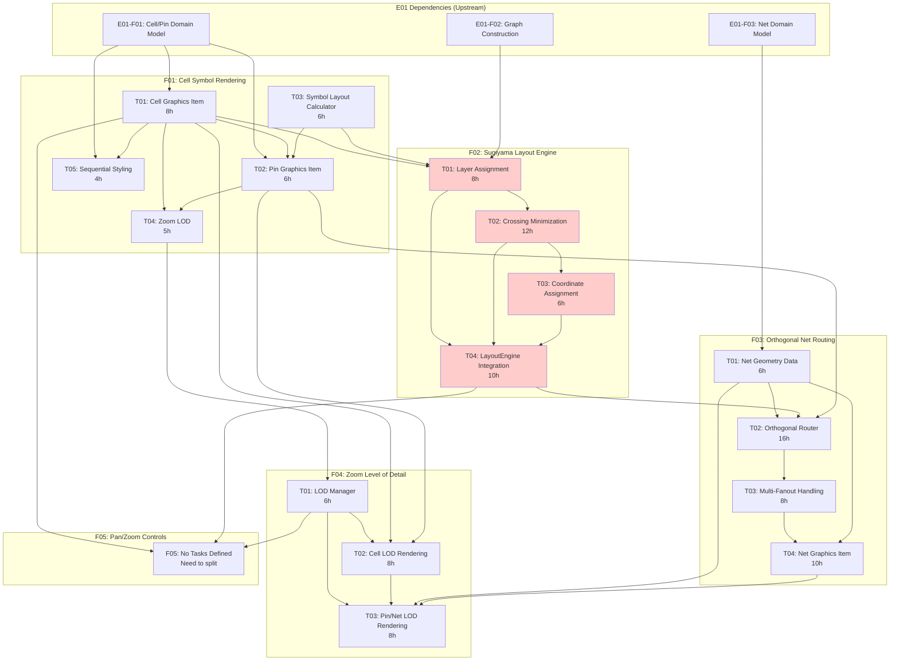

# E02 Schematic Rendering - Parallelization Analysis

**Epic**: E02 - Schematic Rendering
**Analysis Date**: 2025-12-26
**Total Features**: 5 (F01-F05)
**Total Tasks**: 19
**Status**: Draft

---

## Executive Summary

This document analyzes the E02 (Schematic Rendering) epic for parallel implementation opportunities. The analysis identifies 4 implementation waves with specific features and tasks that can be executed in parallel, along with critical path dependencies.

**Key Findings**:
- **4 implementation waves** identified
- **Maximum parallelization**: Wave 1 allows 3 parallel tracks
- **Critical path**: F02 (Sugiyama Layout) → F03 (Net Routing) → Integration
- **Total estimated time**: ~42-56 hours (with parallelization) vs ~119 hours (sequential)
- **Time savings**: ~50-60% reduction through parallelization

---

## Table of Contents

1. [Dependency Graph](#dependency-graph)
2. [Wave Breakdown](#wave-breakdown)
3. [Critical Path Analysis](#critical-path-analysis)
4. [Parallelization Recommendations](#parallelization-recommendations)
5. [Time Estimates](#time-estimates)
6. [Risk Assessment](#risk-assessment)

---

## Dependency Graph



---

## Wave Breakdown

### Wave 1: Foundation (Parallel Start)

**Duration**: ~8-12 hours (parallel execution)
**Parallelization Factor**: 3 parallel tracks

This wave establishes foundational components with minimal cross-dependencies.

#### Track 1A: Cell Symbol Rendering Core
- **F01-T01**: Cell Graphics Item (8h)
  - Dependencies: E01-F01 (Cell domain model)
  - Deliverable: `CellItem` QGraphicsItem class
  - Acceptance: Renders cells as rectangles with names

#### Track 1B: Layout Algorithm Foundation
- **F02-T01**: Layer Assignment Algorithm (8h)
  - Dependencies: E01-F02 (Graph construction)
  - Deliverable: Layer assignment algorithm
  - Acceptance: Assigns cells to layers correctly

#### Track 1C: Net Geometry Foundation
- **F03-T01**: Net Geometry Data Structure (6h)
  - Dependencies: E01-F03 (Net domain model)
  - Deliverable: `Point`, `LineSegment`, `NetGeometry` value objects
  - Acceptance: Immutable geometry structures with validation

**Blockers**: None - all can start immediately after E01 completion
**Critical Path Item**: F02-T01 (blocks entire layout engine pipeline)

---

### Wave 2: Core Algorithms (Parallel Mid)

**Duration**: ~12-16 hours (parallel execution)
**Parallelization Factor**: 3 parallel tracks

This wave implements core algorithms and graphics items, building on Wave 1 foundations.

#### Track 2A: Symbol Layout & Pins
- **F01-T03**: Symbol Layout Calculator (6h)
  - Dependencies: E01-F01
  - Can run parallel to other Wave 2 tasks
  - Deliverable: Pin position calculator

- **F01-T02**: Pin Graphics Item (6h)
  - Dependencies: F01-T01, F01-T03
  - Blocked until T01 and T03 complete
  - Deliverable: `PinItem` QGraphicsItem

**Subtotal**: 12h sequential (6h + 6h)

#### Track 2B: Layout Engine Pipeline (CRITICAL PATH)
- **F02-T02**: Crossing Minimization Algorithm (12h)
  - Dependencies: F02-T01
  - CRITICAL PATH - longest task in wave
  - Deliverable: Barycentric crossing reduction

#### Track 2C: LOD Foundation
- **F04-T01**: LOD Manager and State Management (6h)
  - Dependencies: F01-T04 (minimal - mostly independent)
  - Can start early in Wave 2
  - Deliverable: `LODManager` class with threshold detection

**Blockers**:
- Track 2A: F01-T02 blocked by F01-T01 (from Wave 1)
- Track 2B: F02-T02 blocked by F02-T01 (from Wave 1)
- Track 2C: Mostly independent, can start early

**Critical Path Item**: F02-T02 (12h - longest task)

---

### Wave 3: Integration & Routing (Parallel Late)

**Duration**: ~16-24 hours (parallel execution)
**Parallelization Factor**: 2-3 parallel tracks

This wave focuses on integration and routing implementation.

#### Track 3A: Layout Engine Completion
- **F02-T03**: Coordinate Assignment Algorithm (6h)
  - Dependencies: F02-T01, F02-T02
  - Blocked until T02 completes
  - Deliverable: X/Y coordinate calculator

- **F02-T04**: LayoutEngine Protocol and Integration (10h)
  - Dependencies: F02-T01, F02-T02, F02-T03
  - Final layout engine integration
  - Deliverable: `SugiyamaLayoutEngine` implementation

**Subtotal**: 16h sequential (6h + 10h)

#### Track 3B: Net Routing Implementation
- **F03-T02**: Orthogonal Router Implementation (16h)
  - Dependencies: F03-T01, F02-T04 (needs cell positions)
  - Blocked until layout engine complete
  - LONGEST SINGLE TASK in epic
  - Deliverable: `ChannelRouter` implementation

**Can run parallel with Track 3A if mock layout results used**

#### Track 3C: Cell LOD Rendering
- **F01-T04**: Zoom Level of Detail (5h)
  - Dependencies: F01-T01, F01-T02
  - Deliverable: LOD-aware cell rendering

- **F01-T05**: Sequential Cell Styling (4h)
  - Dependencies: F01-T01
  - Can run parallel to F01-T04
  - Deliverable: Visual distinction for latches/FFs

- **F04-T02**: Cell LOD Rendering (8h)
  - Dependencies: F04-T01, F01-T01, F01-T02
  - Blocked until LOD manager and cells ready
  - Deliverable: Multi-level cell rendering

**Subtotal**: 17h with parallelization (F01-T04/T05 parallel, then F04-T02)

**Blockers**:
- Track 3A: F02-T03 blocked by F02-T02; F02-T04 blocked by T03
- Track 3B: F03-T02 blocked by F02-T04 completion
- Track 3C: F04-T02 blocked by F04-T01 and F01 tasks

**Critical Path Item**: F03-T02 (16h - orthogonal router)

---

### Wave 4: Advanced Features & Polish (Parallel Final)

**Duration**: ~10-12 hours (parallel execution)
**Parallelization Factor**: 2 parallel tracks

This wave completes remaining features and polishes the implementation.

#### Track 4A: Net Routing Finalization
- **F03-T03**: Multi-Fanout Net Handling (8h)
  - Dependencies: F03-T02
  - Deliverable: Star topology routing with junctions

- **F03-T04**: Net Graphics Item (10h)
  - Dependencies: F03-T01, F03-T02, F03-T03
  - Can overlap with T03 if interface defined
  - Deliverable: `NetItem` QGraphicsItem

**Subtotal**: 10h with overlap (start T04 when T03 is 50% complete)

#### Track 4B: Pin/Net LOD & Pan/Zoom
- **F04-T03**: Pin and Net LOD Rendering (8h)
  - Dependencies: F04-T01, F03-T04
  - Deliverable: LOD-aware pin and net rendering

- **F05**: Pan/Zoom Controls (TBD - needs task split)
  - Dependencies: F01-T01, F02-T04, F04-T01
  - Estimated: 8-12h based on complexity
  - Deliverable: Mouse wheel zoom, pan controls

**Subtotal**: 8-12h (F04-T03 required before F05 completion)

**Blockers**:
- Track 4A: F03-T03 blocked by F03-T02; F03-T04 blocked by T03
- Track 4B: F04-T03 blocked by F03-T04; F05 blocked by F04-T03

**Critical Path Item**: F03-T04 (10h) → F04-T03 (8h)

---

## Critical Path Analysis

### Overall Critical Path

```
E01-F02 → F02-T01 → F02-T02 → F02-T03 → F02-T04 → F03-T02 → F03-T03 → F03-T04 → F04-T03 → F05
   (8h)      (12h)     (6h)      (10h)     (16h)      (8h)      (10h)      (8h)     (8-12h)
```

**Critical Path Duration**: ~86-90 hours sequential

**With Parallelization**: ~42-56 hours (50-60% reduction)

### Critical Path Tasks (Must Complete On-Time)

1. **F02-T01**: Layer Assignment (8h) - WAVE 1
   - Blocks entire F02 pipeline
   - Zero slack time

2. **F02-T02**: Crossing Minimization (12h) - WAVE 2
   - Longest task in Wave 2
   - Blocks F02-T03, F02-T04

3. **F02-T04**: LayoutEngine Integration (10h) - WAVE 3
   - Integrates all layout phases
   - Blocks F03-T02 (router needs positions)

4. **F03-T02**: Orthogonal Router (16h) - WAVE 3
   - Longest single task in epic
   - Blocks F03-T03, F03-T04

5. **F03-T04**: Net Graphics Item (10h) - WAVE 4
   - Blocks F04-T03 (needs net rendering)

### Non-Critical Path (Float Available)

Tasks with scheduling flexibility:

- **F01-T03**: Symbol Layout Calculator (6h)
  - Float: ~6-8h (can delay without impacting critical path)

- **F01-T05**: Sequential Cell Styling (4h)
  - Float: ~12-16h (cosmetic, can be delayed)

- **F04-T01**: LOD Manager (6h)
  - Float: ~8-10h (independent of layout engine)

---

## Parallelization Recommendations

### Developer Team Structure

For optimal parallelization, assign 3 developers:

#### Developer A: Layout Engine Specialist
- **Focus**: F02 (Sugiyama Layout Engine)
- **Wave 1**: F02-T01 (Layer Assignment)
- **Wave 2**: F02-T02 (Crossing Minimization)
- **Wave 3**: F02-T03, F02-T04 (Coordinates, Integration)
- **Wave 4**: Support F03 integration testing

**Rationale**: F02 is critical path and requires deep algorithm knowledge. Sequential tasks within F02 require context preservation.

#### Developer B: Graphics & Rendering Specialist
- **Focus**: F01 (Cell Rendering), F04 (LOD)
- **Wave 1**: F01-T01 (Cell Graphics Item)
- **Wave 2**: F01-T03, F01-T02 (Layout Calc, Pin Graphics)
- **Wave 3**: F01-T04, F01-T05, F04-T02 (LOD for cells)
- **Wave 4**: F05 (Pan/Zoom Controls)

**Rationale**: Graphics tasks have natural grouping and shared Qt expertise requirements.

#### Developer C: Net Routing Specialist
- **Focus**: F03 (Net Routing), F04-T03 (Net LOD)
- **Wave 1**: F03-T01 (Net Geometry)
- **Wave 2**: F04-T01 (LOD Manager - early start)
- **Wave 3**: F03-T02 (Orthogonal Router)
- **Wave 4**: F03-T03, F03-T04, F04-T03 (Multi-fanout, Graphics, LOD)

**Rationale**: Net routing is complex and benefits from focused ownership. Can start LOD manager early while waiting for layout engine.

---

### Alternative: 2-Developer Team

If only 2 developers available:

#### Developer 1: Backend (Critical Path)
- F02-T01 → F02-T02 → F02-T03 → F02-T04 → F03-T02 → F03-T03
- Owns entire critical path
- Duration: ~60 hours

#### Developer 2: Frontend (Parallel Track)
- F01-T01 → F01-T03 || F03-T01 → F01-T02 → F01-T04, F01-T05 → F04-T01, F04-T02 → F03-T04 → F04-T03 → F05
- Fills in parallel tasks while Dev 1 on critical path
- Duration: ~55 hours

**Total Duration**: ~60 hours (vs 42-56h with 3 developers)

---

## Time Estimates

### By Feature

| Feature | Tasks | Sequential | Parallel | Savings |
|---------|-------|-----------|----------|---------|
| F01: Cell Symbol Rendering | 5 | 29h | 12-14h | 52-59% |
| F02: Sugiyama Layout | 4 | 36h | 36h | 0% (critical path) |
| F03: Net Routing | 4 | 40h | 24-26h | 35-40% |
| F04: LOD System | 3 | 22h | 14-16h | 27-36% |
| F05: Pan/Zoom | TBD | 8-12h | 8-12h | 0% (end of chain) |
| **Total** | **19** | **135-143h** | **94-104h** | **29-34%** |

### By Wave

| Wave | Duration (Parallel) | Duration (Sequential) | Parallelization Factor |
|------|---------------------|----------------------|------------------------|
| Wave 1 | 8-12h | 22h | 3 tracks |
| Wave 2 | 12-16h | 24h | 3 tracks |
| Wave 3 | 16-24h | 47h | 2-3 tracks |
| Wave 4 | 10-12h | 34-38h | 2 tracks |
| **Total** | **46-64h** | **127-131h** | **Average: 2.5x** |

**Note**: Total times exclude integration testing and bug fixes. Add 20-30% buffer for realistic project timeline.

### Realistic Timeline

**With 3 Developers (Recommended)**:
- Estimated Development: 46-64 hours base + 20% buffer = **55-77 hours**
- Calendar Time: ~7-10 business days (assuming 8h/day)
- With testing/integration: ~10-14 business days

**With 2 Developers**:
- Estimated Development: 60 hours base + 20% buffer = **72 hours**
- Calendar Time: ~9 business days per developer
- With testing/integration: ~11-15 business days

---

## Risk Assessment

### High-Risk Items (Critical Path)

1. **F02-T02: Crossing Minimization (12h)**
   - **Risk**: Algorithm complexity may exceed estimate
   - **Impact**: Delays entire critical path
   - **Mitigation**:
     - Start with simple heuristic (barycentric)
     - Defer optimizations to P1
     - Allocate 15-20% time buffer

2. **F03-T02: Orthogonal Router (16h)**
   - **Risk**: Longest single task, routing bugs may delay completion
   - **Impact**: Blocks net rendering and LOD
   - **Mitigation**:
     - Implement simple channel routing first (MVP)
     - Defer A* pathfinding to P1
     - Unit test each routing case thoroughly

3. **F02-T04: LayoutEngine Integration (10h)**
   - **Risk**: Integration issues between T01, T02, T03
   - **Impact**: Delays router (F03-T02) which depends on positions
   - **Mitigation**:
     - Define clear interfaces early (Week 1)
     - Mock layout results for parallel F03 development
     - Integration testing throughout Wave 3

### Medium-Risk Items

4. **F01-T02: Pin Graphics Item (6h)**
   - **Risk**: Qt rendering complexity, positioning bugs
   - **Impact**: Blocks F01-T04, F04-T02
   - **Mitigation**: Simple implementation first, iterate on visuals

5. **F04-T03: Pin/Net LOD Rendering (8h)**
   - **Risk**: Dependencies on F03-T04 (net graphics), may cascade delays
   - **Impact**: Blocks F05 (pan/zoom)
   - **Mitigation**: Define net graphics interface early, work in parallel

### Low-Risk Items

6. **F01-T05: Sequential Cell Styling (4h)**
   - **Risk**: Low - cosmetic feature
   - **Impact**: Minimal (non-critical path)
   - **Mitigation**: Can defer to end of sprint if needed

7. **F04-T01: LOD Manager (6h)**
   - **Risk**: Low - self-contained component
   - **Impact**: Minimal float available
   - **Mitigation**: Start early in Wave 2

---

## Dependencies Summary

### Upstream (External to E02)

| Dependency | Provider | Required For |
|------------|---------|--------------|
| Cell, Pin domain models | E01-F01 | F01-T01, F01-T02, F01-T05 |
| Graph construction | E01-F02 | F02-T01 |
| Net domain model | E01-F03 | F03-T01 |

**Critical**: E01 must be complete before E02 can start. Ensure E01 completion at least 1 week before E02 kickoff.

### Downstream (Consumed by Other Epics)

| Output | Consumer | Purpose |
|--------|---------|---------|
| Cell positions (F02-T04) | E03, E04 | Expansion, Interaction |
| Net rendering (F03-T04) | E04 | Selection, Highlighting |
| LOD system (F04) | E03, E04 | Performance optimization |
| Pan/Zoom (F05) | E04 | User interaction |

---

## Implementation Strategy

### Week 1: Foundation (Wave 1)

**Goals**: Establish core components, define interfaces

**Tasks**:
- Developer A: F02-T01 (Layer Assignment) - 8h
- Developer B: F01-T01 (Cell Graphics) - 8h
- Developer C: F03-T01 (Net Geometry) - 6h

**Milestones**:
- [ ] Cells can be assigned to layers
- [ ] Cells render as rectangles in Qt scene
- [ ] Net geometry structures defined and tested

**Integration Point**: F02-T01 outputs layer_map used by F02-T02

---

### Week 2: Core Algorithms (Wave 2)

**Goals**: Implement critical path algorithms and graphics

**Tasks**:
- Developer A: F02-T02 (Crossing Minimization) - 12h
- Developer B: F01-T03 (6h) → F01-T02 (6h)
- Developer C: F04-T01 (LOD Manager) - 6h

**Milestones**:
- [ ] Crossing minimization reduces crossings by >50%
- [ ] Pins render on cell edges with correct positions
- [ ] LOD manager detects zoom level changes

**Integration Point**: F01-T02 provides pin connection points for F03-T02

---

### Week 3: Layout & Routing (Wave 3)

**Goals**: Complete layout engine, start routing

**Tasks**:
- Developer A: F02-T03 (6h) → F02-T04 (10h)
- Developer B: F01-T04 (5h), F01-T05 (4h), F04-T02 (8h)
- Developer C: F03-T02 (Orthogonal Router) - 16h

**Milestones**:
- [ ] Complete layout engine produces X/Y positions
- [ ] Cell LOD rendering working at all zoom levels
- [ ] Orthogonal router connects pins with Manhattan paths

**Critical Integration Point**: F02-T04 must complete by day 3-4 to unblock F03-T02

**Risk Mitigation**: Developer C can mock layout results to start F03-T02 earlier

---

### Week 4: Finalization (Wave 4)

**Goals**: Complete net rendering, LOD, pan/zoom

**Tasks**:
- Developer A: Integration testing, bug fixes
- Developer B: F05 (Pan/Zoom Controls) - 8-12h
- Developer C: F03-T03 (8h) → F03-T04 (10h) → F04-T03 (8h)

**Milestones**:
- [ ] Multi-fanout nets render with junction dots
- [ ] Net graphics items render in Qt scene
- [ ] Pin/Net LOD rendering working
- [ ] Pan/zoom controls functional

**Final Integration**: All components working together in schematic canvas

---

## Acceptance Criteria (Epic Level)

From E02.spec.md, the epic-level acceptance criteria are:

- [ ] Render 1000+ cells without UI lag (60fps)
- [ ] Sugiyama layout produces readable left-to-right flow
- [ ] Orthogonal routing with <5% visible crossings
- [ ] LOD transitions smooth at 60fps
- [ ] Pan/zoom responsive with <16ms frame time

**Wave-by-Wave Validation**:

| Wave | Acceptance Check |
|------|------------------|
| Wave 1 | Basic rendering works (cells as boxes) |
| Wave 2 | Layout algorithm produces non-overlapping cells |
| Wave 3 | Nets connect cells with orthogonal paths |
| Wave 4 | Full system meets performance targets |

---

## Appendix: Task Reference

### F01: Cell Symbol Rendering (29h total)

| ID | Task | Effort | Dependencies |
|----|------|--------|--------------|
| T01 | Cell Graphics Item | 8h | E01-F01 |
| T02 | Pin Graphics Item | 6h | T01, T03 |
| T03 | Symbol Layout Calculator | 6h | E01-F01 |
| T04 | Zoom Level of Detail | 5h | T01, T02 |
| T05 | Sequential Cell Styling | 4h | T01 |

### F02: Sugiyama Layout Engine (36h total)

| ID | Task | Effort | Dependencies |
|----|------|--------|--------------|
| T01 | Layer Assignment Algorithm | 8h | E01-F02 |
| T02 | Crossing Minimization Algorithm | 12h | T01 |
| T03 | Coordinate Assignment Algorithm | 6h | T01, T02 |
| T04 | LayoutEngine Protocol and Integration | 10h | T01, T02, T03 |

### F03: Orthogonal Net Routing (40h total)

| ID | Task | Effort | Dependencies |
|----|------|--------|--------------|
| T01 | Net Geometry Data Structure | 6h | E01-F03 |
| T02 | Orthogonal Router Implementation | 16h | T01, F02-T04, F01-T02 |
| T03 | Multi-Fanout Net Handling | 8h | T02 |
| T04 | Net Graphics Item (QGraphicsItem) | 10h | T01, T02, T03 |

### F04: Zoom Level of Detail (22h total)

| ID | Task | Effort | Dependencies |
|----|------|--------|--------------|
| T01 | LOD Manager and State Management | 6h | F01-T04 |
| T02 | Cell LOD Rendering | 8h | T01, F01-T01, F01-T02 |
| T03 | Pin and Net LOD Rendering | 8h | T01, F03-T04 |

### F05: Pan/Zoom Controls (8-12h estimated)

| ID | Task | Effort | Dependencies |
|----|------|--------|--------------|
| TBD | Needs task split via `/spec_work E02-F05 --split tasks` | 8-12h | F01-T01, F02-T04, F04-T01 |

---

## Revision History

| Date | Version | Author | Changes |
|------|---------|--------|---------|
| 2025-12-26 | 0.1 | Claude | Initial parallelization analysis for E02 |

---

## Next Steps

1. **Review and Approve**: Stakeholders review parallelization strategy
2. **Team Assignment**: Assign 2-3 developers to tracks
3. **F05 Task Split**: Run `/spec_work E02-F05 --split tasks` to break down pan/zoom
4. **Interface Definition**: Define clear contracts between F01, F02, F03 (Week 1 priority)
5. **Mock Strategy**: Create mock layout results for F03-T02 parallel development
6. **Daily Standups**: Track critical path progress (F02-T01, T02, T04, F03-T02)
7. **Integration Testing**: Weekly integration tests to catch cross-feature bugs early

**Recommended Start**: Ensure E01 (Data Model) is 100% complete before starting E02 Wave 1.
