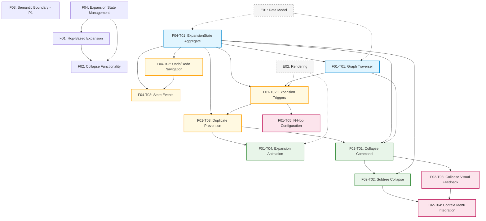
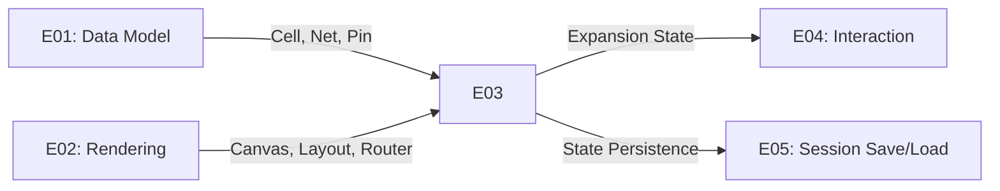

# E03 - Incremental Expansion: Parallelization Analysis

**Epic**: E03 - Incremental Expansion
**Analysis Date**: 2025-12-26
**Total Features**: 4 (F01-F04)
**Total Tasks**: 13 (F03 has no tasks yet)
**Status**: Draft

---

## Executive Summary

E03 (Incremental Expansion) can be implemented in **4 parallelization waves** with an estimated **14-19 days** of sequential time if optimally parallelized. The critical path runs through the domain layer (ExpansionState → Graph Traversal → Expansion Service → UI Integration), while UI components can be developed in parallel once their dependencies are ready.

**Key Insights**:
- **Wave 1** establishes the foundation (ExpansionState aggregate and Graph Traverser)
- **Wave 2** builds core expansion logic on top of Wave 1
- **Wave 3** adds collapse functionality and completes the expansion flow
- **Wave 4** handles UI polish and configuration
- F03 (Semantic Boundary Expansion) is P1 and can be deferred or run separately

---

## Dependency Graph

---

## Wave Breakdown

### Wave 1: Domain Foundation (4-6 days)

**Goal**: Establish core domain models and graph traversal infrastructure

**Tasks**:
| ID | Task | Effort | Est. Hours | Dependencies | Can Parallelize |
|----|------|--------|------------|--------------|-----------------|
| E03-F04-T01 | ExpansionState Aggregate Core | Small | 4h | E01 (Data Model) | ✅ Start immediately |
| E03-F01-T01 | Graph Traverser Service | Medium | 8h | E01, E03-F04-T01 | ⚠️ Wait for F04-T01 |

**Parallelization**:
- **F04-T01** and **F01-T01** can run in parallel IF:
  - F04-T01 defines the interface first (ExpansionState API)
  - F01-T01 uses a stub/mock ExpansionState initially
- **Recommended**: Run F04-T01 first (4h), then F01-T01 (8h) = **12h total**
- **Aggressive**: Both parallel with interface contract = **8h total** (risky)

**Wave 1 Duration**: 1-2 days (12h sequential, 8h parallel)

**Deliverables**:
- `ExpansionState` aggregate with visible cells/nets tracking
- `GraphTraverser` domain service interface and NetworkX implementation
- Unit tests for both components

---

### Wave 2: Core Expansion Logic (5-7 days)

**Goal**: Implement expansion triggers, duplicate prevention, and state management

**Tasks**:
| ID | Task | Effort | Est. Hours | Dependencies | Can Parallelize |
|----|------|--------|------------|--------------|-----------------|
| E03-F04-T02 | Undo/Redo State Navigation | Small | 3h | E03-F04-T01 | ✅ Parallel with F04-T03 |
| E03-F04-T03 | Expansion State Events | Small | 3h | E03-F04-T01 | ✅ Parallel with F04-T02 |
| E03-F01-T02 | Expansion Trigger Handling | Medium | 6h | E01-T01, E02 | ⚠️ Needs Wave 1 |
| E03-F01-T03 | Duplicate Prevention | Low | 4h | E03-F01-T02 | ⚠️ Sequential after T02 |

**Parallelization**:
- **Group A**: F04-T02 + F04-T03 (both extend ExpansionState) = 3h parallel
- **Group B**: F01-T02 → F01-T03 = 10h sequential
- **Total**: Groups A and B can run in parallel = **10h total**

**Wave 2 Duration**: 1-2 days (16h sequential, 10h parallel)

**Deliverables**:
- Undo/redo functionality in ExpansionState
- Domain events for state changes
- Expansion trigger handlers (double-click, context menu)
- Duplicate cell prevention logic

---

### Wave 3: Expansion Animation & Collapse Core (4-6 days)

**Goal**: Visual feedback for expansion, collapse command implementation

**Tasks**:
| ID | Task | Effort | Est. Hours | Dependencies | Can Parallelize |
|----|------|--------|------------|--------------|-----------------|
| E03-F01-T04 | Expansion Animation | Medium | 8h | E03-F01-T03, E02 | ⚠️ Needs Wave 2 |
| E03-F02-T01 | Collapse Command Implementation | Medium | 6h | F01-T03, F04-T01 | ✅ Parallel with F01-T04 |
| E03-F02-T02 | Subtree Collapse Logic | Medium | 5h | E03-F02-T01, F04-T01 | ⚠️ Sequential after T01 |

**Parallelization**:
- **F01-T04** (animation) and **F02-T01** (collapse) address different concerns
- Can run in parallel = **8h total** (max of 8h vs 6h)
- **F02-T02** follows F02-T01 = +5h sequential

**Wave 3 Duration**: 2 days (19h sequential, 13h parallel)

**Deliverables**:
- Smooth fade-in animation for expanded cells/nets
- Collapse command with safety validation
- Subtree collapse logic with parent-child tracking

---

### Wave 4: UI Polish & Configuration (3-4 days)

**Goal**: Context menus, visual feedback, and user configuration

**Tasks**:
| ID | Task | Effort | Est. Hours | Dependencies | Can Parallelize |
|----|------|--------|------------|--------------|-----------------|
| E03-F01-T05 | N-Hop Configuration | Medium | 6h | E03-F01-T02 | ✅ Parallel with F02 tasks |
| E03-F02-T03 | Collapse Visual Feedback | Small | 4h | E03-F02-T01, E02 | ✅ Parallel with F01-T05 |
| E03-F02-T04 | Context Menu Integration | Small | 3h | F02-T02, F02-T03 | ⚠️ Needs F02-T02/T03 |

**Parallelization**:
- **F01-T05** (settings dialog) and **F02-T03** (collapse animation) are independent
- Both can run in parallel = **6h** (max of 6h vs 4h)
- **F02-T04** follows both = +3h sequential

**Wave 4 Duration**: 1-2 days (13h sequential, 9h parallel)

**Deliverables**:
- Settings dialog for default hop count
- Custom N-hop input dialog
- Collapse fade-out animation
- Collapse warning dialog
- Context menu with "Collapse" and "Collapse Subtree" options

---

## Time Estimates

### Sequential Implementation (Single Developer)

| Wave | Sequential Time | Tasks |
|------|-----------------|-------|
| Wave 1 | 12h (1.5 days) | 2 tasks |
| Wave 2 | 16h (2 days) | 4 tasks |
| Wave 3 | 19h (2.5 days) | 3 tasks |
| Wave 4 | 13h (1.5 days) | 3 tasks |
| **Total** | **60h (7.5 days)** | **12 tasks** |

### Parallel Implementation (Multiple Developers)

| Wave | Parallel Time | Max Parallel | Efficiency |
|------|---------------|--------------|------------|
| Wave 1 | 8-12h (1-2 days) | 2 developers | 67-100% |
| Wave 2 | 10h (1.5 days) | 2 developers | 63% |
| Wave 3 | 13h (2 days) | 2 developers | 68% |
| Wave 4 | 9h (1.5 days) | 2 developers | 69% |
| **Total** | **40-44h (5-6 days)** | **2 developers** | **68-73%** |

**Optimal Team Size**: 2 developers
**Time Savings**: 33-40% faster than sequential
**Efficiency**: 68-73% (good parallelization, minimal idle time)

---

## Recommended Implementation Order

### Priority 1: MVP Critical Path (P0)

Execute waves sequentially with parallelization within each wave:

1. **Week 1, Days 1-2**: Wave 1 (Foundation)
   - Dev A: F04-T01 (ExpansionState)
   - Dev B: F01-T01 (Graph Traverser) - starts after F04-T01 interface

2. **Week 1, Days 3-4**: Wave 2 (Core Logic)
   - Dev A: F04-T02 + F04-T03 (Undo/Redo + Events)
   - Dev B: F01-T02 → F01-T03 (Triggers + Duplicate Prevention)

3. **Week 2, Days 1-2**: Wave 3 (Animation & Collapse)
   - Dev A: F01-T04 (Expansion Animation)
   - Dev B: F02-T01 → F02-T02 (Collapse Command + Subtree)

4. **Week 2, Days 3-4**: Wave 4 (Polish)
   - Dev A: F01-T05 (N-Hop Configuration)
   - Dev B: F02-T03 → F02-T04 (Visual Feedback + Context Menu)

**Total Duration**: 8-10 business days with 2 developers

### Priority 2: Deferred (P1)

**F03 (Semantic Boundary Expansion)**:
- Not split into tasks yet
- Can be implemented after MVP
- Estimated 2-3 days (10-15h)
- Builds on F01 (requires Graph Traverser)

---

## Critical Dependencies

### Blocking External Dependencies

| External Epic | Required For | Risk | Mitigation |
|---------------|--------------|------|------------|
| E01 (Data Model) | F04-T01, F01-T01 | **High** | Implement Cell, Net, Pin entities first |
| E02 (Rendering) | F01-T02, F01-T04 | **Medium** | Use mock canvas/items, integrate later |

**Recommendation**: Ensure E01 (Data Model) is complete before starting E03. E02 (Rendering) can proceed in parallel with mocks.

### Internal Blocking Dependencies

| Task | Blocks | Duration Impact |
|------|--------|-----------------|
| F04-T01 | All expansion/collapse logic | +12h to critical path |
| F01-T01 | F01-T02, F02-T01 | +8h to critical path |
| F01-T02 | F01-T03, F01-T04 | +6h to critical path |

**Critical Path**: E01 → F04-T01 → F01-T01 → F01-T02 → F01-T03 → F01-T04 = **38h**

---

## Risk Assessment

### High Risk

| Risk | Impact | Probability | Mitigation |
|------|--------|-------------|------------|
| Graph traversal performance issues | High | Medium | Profile early with 100K cell netlists, optimize BFS |
| ExpansionState threading issues | High | Low | Add thread safety tests, use locks if needed |
| Animation performance on large expansions | Medium | Medium | Add "Reduce motion" setting, batch rendering |

### Medium Risk

| Risk | Impact | Probability | Mitigation |
|------|--------|-------------|------------|
| Collapse orphans connected cells | Medium | Medium | Thorough safety validation, user warnings |
| Undo/redo stack memory usage | Medium | Low | Limit history to 100 actions, trim old entries |
| Layout thrashing during expansion | Medium | Medium | Use incremental layout, freeze existing cells |

### Low Risk

| Risk | Impact | Probability | Mitigation |
|------|--------|-------------|------------|
| Context menu conflicts with existing UI | Low | Low | Coordinate with E04 (Interaction) team |
| Settings persistence across platforms | Low | Medium | Use QSettings, test on Linux |

---

## Testing Strategy

### Unit Testing (Per Wave)

| Wave | Test Coverage Target | Critical Tests |
|------|---------------------|----------------|
| Wave 1 | 95%+ | ExpansionState mutations, Graph traversal correctness |
| Wave 2 | 95%+ | Undo/redo cycles, Event emission, Duplicate filtering |
| Wave 3 | 90%+ | Collapse safety validation, Subtree traversal |
| Wave 4 | 85%+ | UI interactions, Settings persistence |

### Integration Testing (End of Each Wave)

- **Wave 1**: Graph traversal with realistic netlists
- **Wave 2**: Expansion flow from UI trigger to state update
- **Wave 3**: Full expand → animate → collapse cycle
- **Wave 4**: Complete user workflows (expand N hops, collapse subtree)

### Performance Testing (End of Wave 3)

- 1-hop expansion on 100K cell design (<100ms)
- 5-hop expansion on 100K cell design (<500ms)
- Collapse animation 60 FPS for 50 cells

---

## Wave Completion Checklist

### Wave 1 Complete When:
- [ ] ExpansionState passes all unit tests (100% coverage)
- [ ] GraphTraverser correctly traverses 1-5 hops in fanin/fanout
- [ ] Integration test: Graph traversal on 10K cell netlist
- [ ] Performance: 1-hop traversal <100ms on 100K cells

### Wave 2 Complete When:
- [ ] Undo/redo works for 10+ action cycles
- [ ] Domain events emitted for all state changes
- [ ] Double-click triggers expansion with correct hop count
- [ ] Duplicate cells never appear after sequential expansions
- [ ] Integration test: Full UI → service → domain flow

### Wave 3 Complete When:
- [ ] Expansion animation smooth at 60 FPS for 50 cells
- [ ] Collapse safety validation prevents orphaning
- [ ] Subtree collapse recursively collects all descendants
- [ ] Integration test: Expand 3 times → collapse subtree
- [ ] Performance: Collapse <100ms for 50 cells

### Wave 4 Complete When:
- [ ] Settings dialog saves/loads default hop count
- [ ] Custom N-hop dialog accepts user input
- [ ] Collapse animation fades out smoothly
- [ ] Context menu shows correct enabled/disabled states
- [ ] All keyboard shortcuts work (Delete, Shift+Delete)
- [ ] Integration test: Complete user journey (load → expand → configure → collapse)

---

## Dependencies on Other Epics

**Coordinate with**:
- **E01 Team**: Ensure Cell, Net, Pin entities ready by start of Wave 1
- **E02 Team**: Provide layout engine and net router interfaces by Wave 2
- **E04 Team**: Share selection and interaction patterns for Wave 3
- **E05 Team**: ExpansionState serialization needs for future work

---

## Metrics & Success Criteria

### Development Metrics

| Metric | Target | Measurement |
|--------|--------|-------------|
| Code Coverage | 90%+ | pytest --cov |
| Type Safety | 100% | mypy --strict |
| Performance (1-hop) | <100ms | pytest --benchmark |
| Performance (5-hop) | <500ms | pytest --benchmark |
| Animation FPS | 60 FPS | Manual profiling |

### User Experience Metrics

| Metric | Target | Measurement |
|--------|--------|-------------|
| Expansion responsiveness | <100ms | User perception |
| Animation smoothness | No jank | Visual QA |
| Collapse accuracy | 0 orphaned cells | Automated tests |
| Undo/redo reliability | 100% reversible | Test scenarios |

---

## Conclusion

E03 (Incremental Expansion) is well-structured for parallel implementation with **4 clear waves** and minimal blocking dependencies. The **critical path is 5-6 days** with 2 developers working in parallel, or **7.5 days** with a single developer.

**Key Success Factors**:
1. **Complete E01 (Data Model) first** - blocking dependency
2. **Start with Wave 1 foundation** - ExpansionState and GraphTraverser are critical
3. **Parallelize within waves** - 2 developers optimal, 3+ shows diminishing returns
4. **Test incrementally** - don't defer testing to end
5. **Profile early** - performance targets are aggressive (100ms, 500ms)

**Recommended Start**: Begin Wave 1 as soon as E01 domain models are available. E02 can proceed in parallel with stub interfaces.

---

## Revision History

| Date | Version | Author | Changes |
|------|---------|--------|---------|
| 2025-12-26 | 0.1 | Claude | Initial parallelization analysis for E03 |
