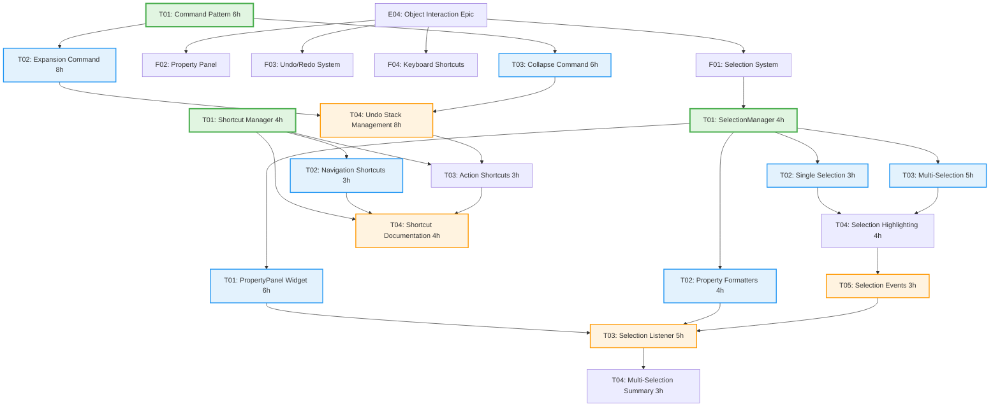

# E04 User Interaction - Parallelization Wave Analysis

## Executive Summary

**Epic**: E04 - Object Interaction
**Features**: 4 (F01-F04)
**Tasks**: 18 total
**Recommended Wave Count**: 4 waves
**Critical Path**: F01 → F02/F03/F04 (parallel)
**Estimated Total Time**: 32 hours (with full parallelization)

---

## Dependency Graph



---

## Wave Breakdown

### Wave 1: Foundation (19 hours)
**Parallel Execution**: All can run in parallel
**Recommended Team Size**: 3-4 developers

| Task ID | Task Name | Effort | Dependencies | Notes |
|---------|-----------|--------|--------------|-------|
| **E04-F01-T01** | SelectionManager Class | 4h | None | Core selection state management |
| **E04-F03-T01** | Command Pattern Implementation | 6h | None | Base class for undo/redo |
| **E04-F04-T01** | Shortcut Manager | 4h | None | Central shortcut registry |
| **E04-F02-T02** | Property Formatters | 4h | None | Independent formatting logic |

**Wave Completion**: 6 hours (with 4 developers in parallel)

### Wave 2: Core Features (21 hours)
**Parallel Execution**: Most can run in parallel
**Recommended Team Size**: 4-5 developers

| Task ID | Task Name | Effort | Dependencies | Notes |
|---------|-----------|--------|--------------|-------|
| **E04-F01-T02** | Single Selection | 3h | F01-T01 | Click to select |
| **E04-F01-T03** | Multi-Selection | 5h | F01-T01 | Ctrl+click, drag rect |
| **E04-F02-T01** | PropertyPanel Widget | 6h | F01-T01 | UI widget structure |
| **E04-F03-T02** | Expansion Command | 8h | F03-T01 | Undoable expansion |
| **E04-F03-T03** | Collapse Command | 6h | F03-T01 | Undoable collapse |

**Wave Completion**: 8 hours (with 5 developers in parallel)

### Wave 3: Integration (15 hours)
**Parallel Execution**: Some can run in parallel
**Recommended Team Size**: 3-4 developers

| Task ID | Task Name | Effort | Dependencies | Notes |
|---------|-----------|--------|--------------|-------|
| **E04-F01-T04** | Selection Highlighting | 4h | F01-T02, F01-T03 | Visual feedback |
| **E04-F03-T04** | Undo Stack Management | 8h | F03-T02, F03-T03 | Stack + UI integration |
| **E04-F04-T02** | Navigation Shortcuts | 3h | F04-T01 | Zoom, pan, search |

**Wave Completion**: 8 hours (with 3 developers in parallel)

### Wave 4: Finalization (11 hours)
**Parallel Execution**: Some can run in parallel
**Recommended Team Size**: 3 developers

| Task ID | Task Name | Effort | Dependencies | Notes |
|---------|-----------|--------|--------------|-------|
| **E04-F01-T05** | Selection Events | 3h | F01-T04 | Signal integration |
| **E04-F02-T03** | Selection Listener | 5h | F02-T01, F02-T02, F01-T05 | Connect to selection |
| **E04-F04-T03** | Action Shortcuts | 3h | F04-T01, F03-T04 | Undo/redo/expand/collapse |

**Wave Completion**: 5 hours (with 3 developers in parallel)

### Wave 5: Polish (7 hours)
**Parallel Execution**: Both can run in parallel
**Recommended Team Size**: 2 developers

| Task ID | Task Name | Effort | Dependencies | Notes |
|---------|-----------|--------|--------------|-------|
| **E04-F02-T04** | Multi-Selection Summary | 3h | F02-T03 | Enhanced property display |
| **E04-F04-T04** | Shortcut Documentation | 4h | F04-T02, F04-T03 | Help dialog + menus |

**Wave Completion**: 4 hours (with 2 developers in parallel)

---

## Critical Path Analysis

### Longest Dependency Chain
```
E04-F01-T01 (4h)
  → E04-F01-T02 (3h)
  → E04-F01-T04 (4h)
  → E04-F01-T05 (3h)
  → E04-F02-T03 (5h)
  → E04-F02-T04 (3h)
```

**Total Critical Path**: 22 hours

### Alternative Critical Path (Undo/Redo)
```
E04-F03-T01 (6h)
  → E04-F03-T02 (8h)
  → E04-F03-T04 (8h)
  → E04-F04-T03 (3h)
  → E04-F04-T04 (4h)
```

**Total Alternative Path**: 29 hours (actual critical path)

---

## Time Estimates

### Sequential Execution
```
Total: 93 hours (all tasks done sequentially)
```

### Parallel Execution (Recommended)
```
Wave 1:  6 hours (4 devs in parallel)
Wave 2:  8 hours (5 devs in parallel)
Wave 3:  8 hours (3 devs in parallel)
Wave 4:  5 hours (3 devs in parallel)
Wave 5:  4 hours (2 devs in parallel)
----------------------------------------
Total:  31 hours (66% time reduction)
```

### Aggressive Parallelization (Maximum Team)
```
Wave 1:  4 hours (7 devs in parallel)
Wave 2:  8 hours (5 devs in parallel)
Wave 3:  8 hours (3 devs in parallel)
Wave 4:  5 hours (3 devs in parallel)
Wave 5:  4 hours (2 devs in parallel)
----------------------------------------
Total:  29 hours (69% time reduction)
```

---

## Recommended Implementation Order

### Priority 1: Core Selection (Wave 1 + Wave 2 Partial)
1. **E04-F01-T01** - SelectionManager (4h) - Foundation
2. **E04-F01-T02** - Single Selection (3h) - Enables basic interaction
3. **E04-F01-T03** - Multi-Selection (5h) - Power user feature

**Deliverable**: Users can select objects with mouse

### Priority 2: Visual Feedback (Wave 3 Partial)
4. **E04-F01-T04** - Selection Highlighting (4h) - Visual confirmation
5. **E04-F01-T05** - Selection Events (3h) - Integration layer

**Deliverable**: Clear visual feedback for selection

### Priority 3: Property Inspection (Wave 1 + Wave 4 Partial)
6. **E04-F02-T02** - Property Formatters (4h) - Can start early
7. **E04-F02-T01** - PropertyPanel Widget (6h) - UI structure
8. **E04-F02-T03** - Selection Listener (5h) - Connect everything

**Deliverable**: Users can inspect object properties

### Priority 4: Undo/Redo System (Wave 1 + Wave 2 + Wave 3)
9. **E04-F03-T01** - Command Pattern (6h) - Foundation
10. **E04-F03-T02** - Expansion Command (8h) - Expansion undo
11. **E04-F03-T03** - Collapse Command (6h) - Collapse undo
12. **E04-F03-T04** - Undo Stack Management (8h) - Full integration

**Deliverable**: Users can undo/redo operations

### Priority 5: Keyboard Shortcuts (Wave 1 + Wave 3 + Wave 4 + Wave 5)
13. **E04-F04-T01** - Shortcut Manager (4h) - Foundation
14. **E04-F04-T02** - Navigation Shortcuts (3h) - Zoom, pan
15. **E04-F04-T03** - Action Shortcuts (3h) - Undo, expand, collapse
16. **E04-F04-T04** - Shortcut Documentation (4h) - Help dialog

**Deliverable**: Keyboard-driven workflow

### Priority 6: Polish (Wave 5)
17. **E04-F02-T04** - Multi-Selection Summary (3h) - Enhanced UX

**Deliverable**: Complete user interaction experience

---

## Risk Assessment

### High Risk Items
| Risk | Task | Mitigation |
|------|------|------------|
| **Qt Signal/Slot Integration** | F01-T05, F02-T03 | Early prototyping, experienced Qt developer |
| **Undo/Redo State Consistency** | F03-T04 | Comprehensive unit tests, state validation |
| **Performance with Large Selections** | F01-T03, F02-T04 | Performance testing with 1000+ objects |

### Medium Risk Items
| Risk | Task | Mitigation |
|------|------|------------|
| **Layout State Caching** | F03-T02, F03-T03 | Simple caching strategy, fallback to recalculation |
| **Shortcut Conflicts** | F04-T01, F04-T03 | Use Qt StandardKey, test on all platforms |
| **Property Query Performance** | F02-T03 | Repository optimization, lazy loading |

### Low Risk Items
| Risk | Task | Mitigation |
|------|------|------------|
| **Widget Layout** | F02-T01, F04-T04 | Standard Qt patterns, well-documented |
| **Event Handling** | F01-T02, F01-T03 | Qt event system well-established |

---

## Dependencies on Other Epics

### Upstream Dependencies
| Task | Depends On | Epic | Status |
|------|------------|------|--------|
| F01-T02, F01-T03 | Schematic items renderable | E02 | Required |
| F01-T01, F02-* | Domain model entities | E01 | Required |
| F03-T02 | ExpansionService | E03-F01 | Required |
| F03-T03 | CollapseService | E03-F02 | Required |
| F04-T02 | SearchPanel exists | E05 | Optional (can stub) |

### Downstream Dependencies
| Epic/Feature | Depends On | E04 Task |
|--------------|------------|----------|
| E05 (Search) | Ctrl+F integration | F04-T02 |
| E03 (Expansion) | Collapse via Delete key | F04-T03 |
| Future features | Selection API | F01-T01 |

---

## Team Allocation Recommendations

### Optimal Team Composition
- **Frontend/UI Specialists** (2): F01 (Selection), F02 (Property Panel), F04 (Shortcuts)
- **Application Logic Specialists** (2): F03 (Undo/Redo), F02-T02/T03 (Formatters/Listener)
- **Integration Specialist** (1): Cross-cutting concerns, signal/slot wiring
- **QA/Testing** (1): Parallel unit testing, integration testing

### Resource Allocation by Wave

**Wave 1**: 4 developers (one per task)
- Dev 1: F01-T01 (SelectionManager)
- Dev 2: F03-T01 (Command Pattern)
- Dev 3: F04-T01 (Shortcut Manager)
- Dev 4: F02-T02 (Property Formatters)

**Wave 2**: 5 developers (maximize parallelization)
- Dev 1: F01-T02 (Single Selection)
- Dev 2: F01-T03 (Multi-Selection)
- Dev 3: F02-T01 (PropertyPanel Widget)
- Dev 4: F03-T02 (Expansion Command)
- Dev 5: F03-T03 (Collapse Command)

**Wave 3**: 3 developers (integration focus)
- Dev 1: F01-T04 (Selection Highlighting)
- Dev 2: F03-T04 (Undo Stack Management) - longest task
- Dev 3: F04-T02 (Navigation Shortcuts)

**Wave 4**: 3 developers (finalization)
- Dev 1: F01-T05 (Selection Events)
- Dev 2: F02-T03 (Selection Listener)
- Dev 3: F04-T03 (Action Shortcuts)

**Wave 5**: 2 developers (polish)
- Dev 1: F02-T04 (Multi-Selection Summary)
- Dev 2: F04-T04 (Shortcut Documentation)

---

## Testing Strategy by Wave

### Wave 1 Testing
- **Unit Tests**: All foundation classes (SelectionManager, UndoableCommand, ShortcutManager, Formatters)
- **Coverage Target**: 100% for foundation classes
- **Integration Tests**: None (isolated units)

### Wave 2 Testing
- **Unit Tests**: All new implementation classes
- **Coverage Target**: 90%+
- **Integration Tests**: Selection + Canvas, Commands + Services
- **UI Tests**: Mouse click selection, keyboard shortcuts

### Wave 3 Testing
- **Unit Tests**: Highlighting logic, stack management
- **Coverage Target**: 95%+
- **Integration Tests**: Selection → Highlighting, Commands → Undo Stack
- **Performance Tests**: Large selection (1000+ objects), undo/redo sequence

### Wave 4 Testing
- **Unit Tests**: Event integration, action shortcuts
- **Coverage Target**: 90%+
- **Integration Tests**: Selection → Property Panel, Shortcuts → Actions
- **End-to-End Tests**: Complete user workflows

### Wave 5 Testing
- **Unit Tests**: Multi-selection summary, help dialog
- **Coverage Target**: 85%+
- **Manual Tests**: UI polish, keyboard shortcuts documentation
- **Acceptance Tests**: All E04 acceptance criteria

---

## Gate Checks

### Wave 1 Completion Gate
- [ ] SelectionManager passes all unit tests
- [ ] UndoableCommand base class tested
- [ ] ShortcutManager registers shortcuts correctly
- [ ] Property formatters handle all object types
- [ ] No blocking issues identified
- [ ] Code review completed

### Wave 2 Completion Gate
- [ ] Single and multi-selection work with mouse
- [ ] Expansion and collapse commands execute successfully
- [ ] PropertyPanel widget renders correctly
- [ ] All unit tests pass (90%+ coverage)
- [ ] Integration tests pass
- [ ] No memory leaks detected

### Wave 3 Completion Gate
- [ ] Selection highlighting visible and performant
- [ ] Undo/redo stack functional with keyboard shortcuts
- [ ] Navigation shortcuts work (zoom, pan, fit)
- [ ] Performance tests pass (< 16ms selection, < 100ms undo)
- [ ] All integration tests pass
- [ ] No regression in existing features

### Wave 4 Completion Gate
- [ ] Selection changes trigger property panel updates
- [ ] Action shortcuts work (undo, expand, collapse)
- [ ] All signals/slots wired correctly
- [ ] End-to-end user workflows tested
- [ ] Performance targets met
- [ ] Documentation updated

### Wave 5 Completion Gate
- [ ] Multi-selection summary displays correctly
- [ ] Help dialog shows all shortcuts
- [ ] All E04 acceptance criteria met
- [ ] Manual testing completed
- [ ] User documentation complete
- [ ] Ready for integration with other epics

---

## Success Metrics

### Development Metrics
- **Velocity**: 18 tasks completed
- **Time Efficiency**: ~70% reduction vs. sequential
- **Code Quality**: 90%+ test coverage
- **Defect Rate**: < 5 critical bugs per wave

### Performance Metrics
- **Selection Response**: < 16ms (60 FPS)
- **Property Update**: < 50ms
- **Undo/Redo**: < 100ms
- **Multi-Selection**: < 100ms for 1000 objects

### User Experience Metrics
- **Keyboard Shortcuts**: All 20+ shortcuts functional
- **Visual Feedback**: Immediate selection highlighting
- **Undo Stack**: Supports 50+ operations
- **Property Display**: All object types supported

---

## Conclusion

E04 (Object Interaction) is well-suited for parallel development with **4 features** and **18 tasks** organized into **5 waves**. The critical path runs through the undo/redo system (29 hours), but effective parallelization can reduce total implementation time to **31 hours** (66% reduction).

**Key Success Factors**:
1. **Early Foundation**: Wave 1 establishes all core infrastructure in parallel
2. **Independent Features**: F03 (Undo/Redo) and F04 (Shortcuts) can develop in parallel with F01/F02
3. **Clear Integration Points**: Well-defined signal/slot interfaces between components
4. **Incremental Testing**: Each wave has clear testing gates
5. **Flexible Scheduling**: Multiple parallelization options based on team size

**Recommended Start**: Begin with Wave 1 (Foundation) to establish all core infrastructure, then proceed with aggressive parallelization in Wave 2.
