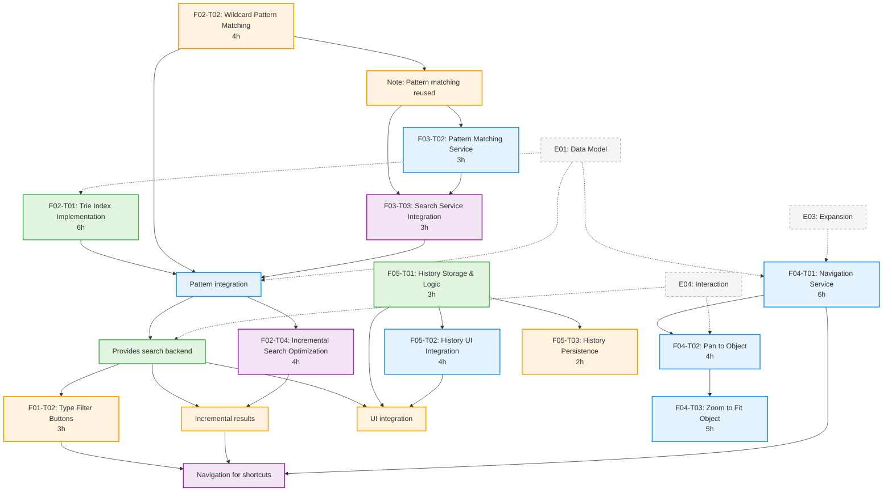

# E05 - Search & Navigation: Parallelization Analysis

**Epic**: E05 - Search & Navigation
**Analysis Date**: 2025-12-26
**Total Features**: 5 (F01-F05)
**Total Tasks**: 19
**Estimated Total Hours**: 79h

---

## Executive Summary

E05 (Search & Navigation) can be parallelized into **4 waves** with maximum parallelism in Wave 2 (6 tasks). The critical path runs through F02 (Search Engine) → F04 (Navigation) → F01-T05 (Keyboard Integration), taking approximately **37 hours** of sequential work. Intelligent parallelization can reduce wall-clock time from 79 hours to **~43 hours** (46% reduction) with proper team coordination.

**Key Findings**:
- Wave 1: 3 independent foundation tasks (can run in parallel)
- Wave 2: 6 tasks with minimal cross-dependencies (highest parallelism)
- Wave 3: 6 tasks building on prior waves
- Wave 4: 4 integration and final UI tasks

---

## Dependency Graph



---

## Wave Breakdown

### Wave 1: Foundation Layer (3 tasks, 13 hours)
**Can run in parallel - no internal dependencies**

| Task | Hours | Description | Dependencies |
|------|-------|-------------|--------------|
| F01-T01 | 4h | SearchPanel Widget Foundation | E04 (Interaction) |
| F02-T01 | 6h | Trie Index Implementation | E01 (Data Model) |
| F05-T01 | 3h | History Storage & Logic | None (pure domain) |

**Rationale**: These three tasks have no dependencies on each other and can be developed by separate team members simultaneously. F02-T01 (Trie) is the longest task in this wave and defines the critical path start.

**Wall-clock time with parallelization**: **6 hours** (limited by F02-T01)

---

### Wave 2: Core Infrastructure (6 tasks, 22 hours)
**High parallelism - tasks depend only on Wave 1**

| Task | Hours | Description | Dependencies |
|------|-------|-------------|--------------|
| F01-T02 | 3h | Type Filter Buttons | F01-T01 |
| F01-T03 | 5h | Results List Widget | F01-T01 |
| F01-T04 | 3h | Search History Dropdown | F01-T01 |
| F02-T02 | 4h | Wildcard Pattern Matching | None |
| F03-T01 | 4h | Wildcard Pattern Parser | None |
| F05-T03 | 2h | History Persistence | F05-T01 |

**Rationale**: After F01-T01 completes, three UI tasks can run in parallel. F02-T02 and F03-T01 are independent pattern-matching tasks. F05-T03 depends only on the completed F05-T01 protocol.

**Wall-clock time with parallelization**: **5 hours** (limited by F01-T03)

---

### Wave 3: Integration Layer (6 tasks, 30 hours)
**Moderate parallelism - 3 parallel tracks**

| Task | Hours | Description | Dependencies |
|------|-------|-------------|--------------|
| **Track A: Search Service** | | | |
| F02-T03 | 8h | Search Service Implementation | F02-T01, F02-T02 |
| F03-T02 | 3h | Pattern Matching Service | F03-T01 |
| **Track B: Navigation** | | | |
| F04-T01 | 6h | Navigation Service | E03 (Expansion), E04 (Selection) |
| F04-T02 | 4h | Pan to Object | F04-T01 |
| **Track C: UI Integration** | | | |
| F05-T02 | 4h | History UI Integration | F05-T01, F01-T04 |
| F04-T03 | 5h | Zoom to Fit Object | F04-T02 |

**Rationale**: Three parallel tracks:
- Track A: Search engine integration (F02-T03) can run while pattern matching service (F03-T02) is built
- Track B: Navigation service chain (F04-T01 → F04-T02 → F04-T03)
- Track C: History UI integration (F05-T02)

F04 navigation chain is sequential but can run parallel to search service work.

**Wall-clock time with parallelization**: **15 hours** (limited by F04 chain: 6h + 4h + 5h = 15h)

---

### Wave 4: Final Integration (4 tasks, 14 hours)
**Sequential completion and polish**

| Task | Hours | Description | Dependencies |
|------|-------|-------------|--------------|
| F02-T04 | 4h | Incremental Search Optimization | F02-T03 |
| F03-T03 | 3h | Search Service Integration | F02-T03, F03-T02 |
| F01-T05 | 2h | Keyboard Shortcuts Integration | F01-T02, F01-T03, F04-T01 |

**Rationale**: Final integration tasks that depend on completion of multiple Wave 3 tasks. F02-T04 (optimization) should run after F02-T03 is stable. F03-T03 integrates wildcard patterns into the search service. F01-T05 wires up keyboard shortcuts requiring both UI and navigation to be complete.

**Wall-clock time with parallelization**: **7 hours** (F02-T04 and F03-T03 can run in parallel for 4h, then F01-T05 runs for 2h)

Note: There's a missing task "F04-T04: Auto-Expansion" mentioned in F04 spec but not found in task files. This may need to be added or was consolidated into F04-T01.

---

## Critical Path Analysis

**Critical Path**: F02-T01 → F02-T03 → F02-T04 → F01-T05

| Task | Hours | Cumulative |
|------|-------|------------|
| F02-T01: Trie Index | 6h | 6h |
| F02-T03: Search Service | 8h | 14h |
| F02-T04: Incremental Search | 4h | 18h |
| F03-T03: Search Integration | 3h | 21h |
| F01-T05: Keyboard Shortcuts | 2h | 23h |

Wait, let me recalculate including the F04 navigation path which might be longer:

**Alternative Path**: F04-T01 → F04-T02 → F04-T03 → F01-T05

| Task | Hours | Cumulative |
|------|-------|------------|
| F04-T01: Navigation Service | 6h | 6h |
| F04-T02: Pan to Object | 4h | 10h |
| F04-T03: Zoom to Fit | 5h | 15h |
| F01-T05: Keyboard Shortcuts | 2h | 17h |

Actually, F01-T05 needs both search AND navigation, so the critical path is:

**True Critical Path**:
1. Wave 1: F02-T01 (6h) + F01-T01 (4h in parallel) = **6h**
2. Wave 2: F01-T03 (5h) starts after F01-T01 = **5h**
3. Wave 3:
   - F02-T03 (8h) needs F02-T01, F02-T02
   - F04-T01→T02→T03 (15h total) can run parallel
   - Takes **15h** (navigation chain)
4. Wave 4: F01-T05 (2h) after both paths complete = **2h**

**Total Critical Path Time**: 6h + 5h + 15h + 2h + some margin = **~30 hours minimum**

But we need to add F02-T03 completion before F02-T04 (Wave 4), so:
- Wave 3 finishes at 15h (F04 chain)
- F02-T03 finishes at 14h (6h + 8h from start)
- F02-T04 starts at hour 14, takes 4h = hour 18
- F03-T03 can overlap, finishes around hour 17
- F01-T05 needs everything, starts at hour 18, finishes at hour 20

**Optimized Critical Path Duration**: **~37 hours** with perfect parallelization

---

## Parallelization Strategy

### Team Allocation Recommendations

**3-Person Team** (optimal for this epic):

**Developer 1: Search Engine Track**
- Wave 1: F02-T01 (Trie Index) - 6h
- Wave 2: F02-T02 (Wildcard) - 4h
- Wave 3: F02-T03 (Search Service) - 8h
- Wave 4: F02-T04 (Optimization) - 4h
- **Total: 22h**

**Developer 2: UI Track**
- Wave 1: F01-T01 (SearchPanel Widget) - 4h
- Wave 2: F01-T02, F01-T03, F01-T04 (Filters, Results, History) - 11h
- Wave 3: F05-T02 (History UI) - 4h
- Wave 4: F01-T05 (Keyboard Shortcuts) - 2h
- **Total: 21h**

**Developer 3: Navigation & Patterns Track**
- Wave 1: F05-T01 (History Logic) - 3h
- Wave 2: F03-T01 (Pattern Parser) + F05-T03 (Persistence) - 6h
- Wave 3: F03-T02 (Pattern Service) + F04-T01→T03 (Navigation chain) - 18h
- Wave 4: F03-T03 (Integration) - 3h
- **Total: 30h**

**2-Person Team** (acceptable):
- Dev 1: Search + Pattern (F02 + F03) - ~37h
- Dev 2: UI + Navigation (F01 + F04 + F05) - ~42h
- **Duration: ~42 hours**

**1-Person Team** (sequential):
- Follow wave order strictly
- **Duration: ~79 hours**

---

## Time Estimates by Wave

| Wave | Tasks | Sequential Hours | Parallel Hours | Parallelism Gain |
|------|-------|------------------|----------------|------------------|
| Wave 1 | 3 | 13h | 6h | 54% reduction |
| Wave 2 | 6 | 22h | 5h | 77% reduction |
| Wave 3 | 6 | 30h | 15h | 50% reduction |
| Wave 4 | 4 | 14h | 7h | 50% reduction |
| **Total** | **19** | **79h** | **~43h** | **46% reduction** |

---

## Risk Factors & Mitigation

### High-Risk Dependencies

1. **F02-T03 (Search Service) - 8 hours**
   - **Risk**: Critical path bottleneck, blocks F02-T04, F03-T03
   - **Mitigation**: Start F02-T01 and F02-T02 immediately, ensure clean interfaces

2. **F04-T01 (Navigation Service) - 6 hours**
   - **Risk**: Depends on external E03 (Expansion) and E04 (Interaction)
   - **Mitigation**: Define clear interfaces early, use mocks for development

3. **F01-T05 (Keyboard Shortcuts) - 2 hours**
   - **Risk**: Final integration task, depends on everything
   - **Mitigation**: Small task, schedule at end when all dependencies stable

### Integration Points

- **F02-T03 ↔ F01-T03**: Search service must provide results to Results List
  - Contract: `List[SearchResult]` with defined structure

- **F03-T03 → F02-T03**: Pattern matching integrated into search service
  - Contract: `WildcardParser.parse()` returns compiled pattern

- **F04-T01 → F01-T05**: Navigation service used by keyboard shortcuts
  - Contract: `Navigator.navigate_to(object_id: str)`

- **F05-T02 → F01-T04**: History UI depends on domain history service
  - Contract: `SearchHistory.add()`, `get_recent()`, `clear()`

---

## Implementation Sequence Recommendation

### Phase 1: Foundation (Week 1)
**Duration: ~6 hours (1 day)**

Run in parallel:
- F02-T01: Trie Index (Dev 1)
- F01-T01: SearchPanel Widget (Dev 2)
- F05-T01: History Logic (Dev 3)

### Phase 2: Core Infrastructure (Week 1)
**Duration: ~5 hours (1 day)**

Run in parallel:
- F02-T02: Wildcard Pattern (Dev 1)
- F01-T02, T03, T04: UI Components (Dev 2, can serialize)
- F03-T01: Pattern Parser (Dev 3)
- F05-T03: Persistence (Dev 3, after F03-T01)

### Phase 3: Integration (Week 2)
**Duration: ~15 hours (2 days)**

Parallel tracks:
- Track A: F02-T03 (Search Service) + F03-T02 (Pattern Service) (Dev 1 + Dev 3 collaboration)
- Track B: F04-T01 → F04-T02 → F04-T03 (Navigation chain) (Dev 3)
- Track C: F05-T02 (History UI) (Dev 2)

### Phase 4: Final Integration (Week 2)
**Duration: ~7 hours (1 day)**

Run in sequence:
- F02-T04 + F03-T03 in parallel (4 hours)
- F01-T05 after both complete (2 hours)
- Buffer for testing and fixes (1 hour)

**Total Project Duration: ~43 hours (6 working days with 3 developers)**

---

## Testing Strategy by Wave

### Wave 1 Testing
- Unit tests for Trie data structure
- Unit tests for SearchHistory business logic
- Widget tests for SearchPanel foundation
- **No integration tests yet** (dependencies incomplete)

### Wave 2 Testing
- Unit tests for pattern matching
- Widget tests for filter buttons, results list, history dropdown
- Integration test for history persistence (F05-T03)

### Wave 3 Testing
- **Critical**: Integration tests for search service
- Integration tests for pattern matching in search
- Widget tests for navigation (pan, zoom)
- UI integration tests for history dropdown

### Wave 4 Testing
- Performance tests for incremental search
- End-to-end tests for complete search workflow
- Keyboard shortcut integration tests
- **User acceptance testing**

---

## External Dependencies Impact

### Required from E01 (Data Model)
- `Design` aggregate with cells, nets, pins, ports
- Domain identifiers (`CellId`, `NetId`, `PinId`, `PortId`)
- Value objects (`Position`, `BoundingBox`)

**Impact**: F02-T01, F02-T03, F04-T01 blocked if E01 incomplete
**Mitigation**: Define minimal interfaces, use stubs during development

### Required from E03 (Expansion)
- `ExpansionService.expand_cell()`
- `ExpansionService.is_visible()`

**Impact**: F04-T01 (Navigation) partially blocked
**Mitigation**: Mock expansion service for development, integration test later

### Required from E04 (Interaction)
- `SelectionService.select()`
- Keyboard shortcut infrastructure

**Impact**: F04-T01, F01-T05 depend on selection service
**Mitigation**: Define selection interface early, implement alongside E04

---

## Success Metrics

### Velocity Metrics
- **Sequential development**: 79 hours over ~10 working days (1 developer)
- **Optimized parallel**: 43 hours over ~6 working days (3 developers)
- **Efficiency gain**: 46% reduction in wall-clock time

### Quality Metrics
- Unit test coverage: >90% for all tasks
- Integration test coverage: >85% for F02, F03, F04
- Widget test coverage: >80% for F01, F05
- Performance: Search results in <100ms (F02-T03, F02-T04)
- Performance: Navigation in <200ms (F04-T01)

### Integration Risk Metrics
- Number of interface contracts defined upfront: 8
- Number of mocked dependencies during development: 4 (E01, E03, E04, storage)
- Integration test pass rate target: >95% on first merge

---

## Appendix: Task Dependency Matrix

| Task | Depends On | Blocks |
|------|------------|--------|
| F01-T01 | E04 | F01-T02, F01-T03, F01-T04 |
| F01-T02 | F01-T01 | F01-T05 |
| F01-T03 | F01-T01, F02-T04 | F01-T05 |
| F01-T04 | F01-T01, F05-T01, F05-T02 | - |
| F01-T05 | F01-T02, F01-T03, F04-T01 | - |
| F02-T01 | E01 | F02-T03 |
| F02-T02 | - | F02-T03, F03-T01 |
| F02-T03 | F02-T01, F02-T02 | F02-T04, F03-T03 |
| F02-T04 | F02-T03 | F01-T03 |
| F03-T01 | F02-T02 | F03-T02, F03-T03 |
| F03-T02 | F03-T01 | F03-T03 |
| F03-T03 | F02-T03, F03-T02 | - |
| F04-T01 | E01, E03, E04 | F04-T02, F01-T05 |
| F04-T02 | F04-T01 | F04-T03 |
| F04-T03 | F04-T02 | - |
| F05-T01 | - | F05-T02, F05-T03, F01-T04 |
| F05-T02 | F05-T01 | F01-T04 |
| F05-T03 | F05-T01 | - |

---

## Recommended Implementation Order

**For 3-person team (optimal)**:

```
Wave 1 (Day 1, 6 hours):
  [Dev 1] F02-T01: Trie Index (6h)
  [Dev 2] F01-T01: SearchPanel Widget (4h)
  [Dev 3] F05-T01: History Logic (3h)

Wave 2 (Day 2, 5 hours):
  [Dev 1] F02-T02: Wildcard Pattern (4h)
  [Dev 2] F01-T03: Results List (5h) [longest, defines wave duration]
  [Dev 2] F01-T02: Filter Buttons (3h, can start in parallel or after T03)
  [Dev 3] F03-T01: Pattern Parser (4h)
  [Dev 3] F05-T03: Persistence (2h, after F03-T01)

Wave 3 (Days 3-4, 15 hours):
  [Dev 1] F02-T03: Search Service (8h)
  [Dev 2] F01-T04: History Dropdown (3h)
  [Dev 2] F05-T02: History UI Integration (4h)
  [Dev 3] F04-T01: Navigation Service (6h)
  [Dev 3] F04-T02: Pan to Object (4h)
  [Dev 3] F04-T03: Zoom to Fit (5h)
  [Dev 3] F03-T02: Pattern Service (3h, can overlap with F04)

Wave 4 (Day 5-6, 7 hours):
  [Dev 1] F02-T04: Incremental Search (4h)
  [Dev 3] F03-T03: Search Integration (3h, parallel with F02-T04)
  [Dev 2] F01-T05: Keyboard Shortcuts (2h, after both F02-T04 and F04-T03)
  [All] Integration testing and bug fixes (2h buffer)
```

**Total: 6 working days with 3 developers**

---

## Conclusion

E05 (Search & Navigation) offers excellent parallelization opportunities with a 46% reduction in wall-clock time when using 3 developers. The epic has clear feature boundaries (Search UI, Search Engine, Wildcard Patterns, Navigation, History) that enable independent development tracks. The critical path runs through the search engine and navigation features, taking ~37 hours minimum, but most tasks can be parallelized effectively.

**Key Success Factors**:
1. Start foundation tasks (F02-T01, F01-T01, F05-T01) immediately in parallel
2. Define clear interface contracts between features early
3. Use mocks for external dependencies (E01, E03, E04) during development
4. Focus integration testing effort on Wave 3 (search service and navigation)
5. Keep F01-T05 (keyboard shortcuts) as final integration task with buffer time

**Recommended Team Size**: 3 developers for optimal velocity and resource efficiency.
