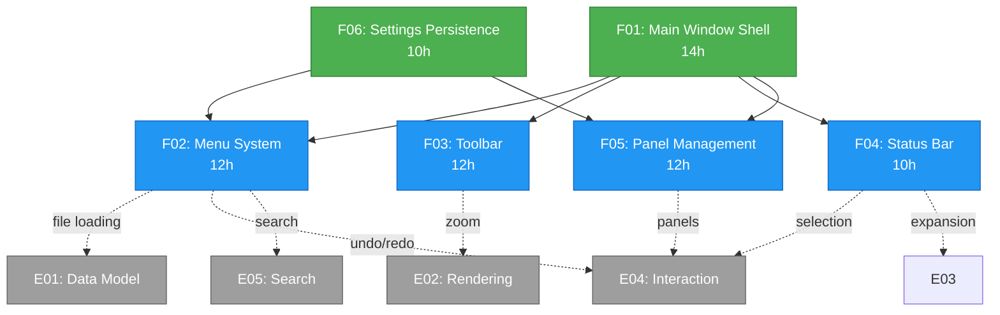

# E06 (UI Framework) Parallelization Analysis

## Executive Summary

**Total Features**: 6 (F01-F06)
**Total Tasks**: 24
**Total Estimated Hours**: ~60-70 hours
**Recommended Waves**: 4 waves
**Parallelization Potential**: High (multiple independent features)

## Dependency Graph



## Feature-Level Analysis

### F01: Main Window Shell (Foundation)
- **Estimated Hours**: 14
- **Tasks**: 5 (T01-T05)
- **Dependencies**: None (foundation)
- **Blocks**: F02, F03, F04, F05
- **Parallelization**: Cannot parallelize internally (sequential tasks)

**Task Dependencies**:
```
T01 (Window Setup, 2h)
  → T02 (Central Widget, 3h)
    → T03 (Dock Widgets, 4h)
      → T04 (Entry Point, 2h)
        → T05 (Integration Testing, 3h)
```

### F02: Menu System
- **Estimated Hours**: 12
- **Tasks**: 4 (T01-T04)
- **Dependencies**: F01 (Main Window), F06 (Settings for recent files)
- **Blocks**: None
- **Parallelization**: Tasks T02-T04 can be parallelized after T01

**Task Dependencies**:
```
T01 (Menu Bar Setup, 2h)
  ├→ T02 (File Menu, 4h) [requires F06]
  ├→ T03 (Edit Menu, 3h)
  └→ T04 (View/Help Menus, 3h)
```

### F03: Toolbar
- **Estimated Hours**: 12
- **Tasks**: 4 (T01-T04)
- **Dependencies**: F01 (Main Window)
- **Blocks**: None
- **Parallelization**: Tasks T02-T04 can be parallelized after T01

**Task Dependencies**:
```
T01 (Toolbar Setup, 3h)
  ├→ T02 (View Controls, 3h)
  ├→ T03 (Edit/Search Tools, 3h)
  └→ T04 (Icon Resources, 3h)
```

### F04: Status Bar
- **Estimated Hours**: 10
- **Tasks**: 4 (T01-T04)
- **Dependencies**: F01 (Main Window)
- **Blocks**: None
- **Parallelization**: All tasks can be parallel after T01

**Task Dependencies**:
```
T01 (Status Bar Setup, 2h)
  ├→ T02 (Selection Display, 3h)
  ├→ T03 (Zoom Display, 2h)
  └→ T04 (File/Count Display, 3h)
```

### F05: Panel Management
- **Estimated Hours**: 12
- **Tasks**: 4 (T01-T04)
- **Dependencies**: F01 (Main Window), F06 (Settings for persistence)
- **Blocks**: None
- **Parallelization**: Tasks can be partially parallelized

**Task Dependencies**:
```
T01 (Panel State Management, 3h)
  ├→ T02 (Layout Persistence, 4h) [requires F06]
  ├→ T03 (Toggle Actions, 2h)
  └→ T04 (Default Reset, 3h)
```

### F06: Settings Persistence (Foundation)
- **Estimated Hours**: 10
- **Tasks**: 4 (T01-T04)
- **Dependencies**: None (infrastructure)
- **Blocks**: F02 (Recent files), F05 (Panel layout)
- **Parallelization**: Tasks T02-T04 can be parallelized after T01

**Task Dependencies**:
```
T01 (QSettings Infrastructure, 2h)
  ├→ T02 (Window Geometry, 3h)
  ├→ T03 (Recent Files, 3h)
  └→ T04 (Migration/Reset, 2h)
```

## Wave Breakdown

### Wave 1: Foundation (16 hours)
**Goal**: Establish core infrastructure

**Features/Tasks**:
- **F01**: Complete all tasks sequentially (14h)
  - T01: QMainWindow Setup (2h)
  - T02: Central Widget Setup (3h)
  - T03: Dock Widget Setup (4h)
  - T04: Application Entry Point (2h)
  - T05: Integration Testing (3h)
- **F06-T01**: QSettings Infrastructure (2h) - **PARALLEL with F01**

**Parallelization**: F06-T01 can run in parallel with F01 tasks
**Critical Path**: F01 (14h)
**Team Size**: 1-2 developers

### Wave 2: Settings & Menu Foundation (11 hours)
**Goal**: Complete settings and establish menu structure

**Features/Tasks**:
- **F06**: Complete remaining tasks (8h) - **ALL PARALLEL**
  - T02: Window Geometry Persistence (3h)
  - T03: Recent Files Management (3h)
  - T04: Settings Migration & Reset (2h)
- **F02-T01**: Menu Bar Setup (2h) - **PARALLEL**
- **F03-T01**: Toolbar Setup (3h) - **PARALLEL**
- **F04-T01**: Status Bar Setup (2h) - **PARALLEL**

**Parallelization**: High - all tasks independent
**Critical Path**: F03-T01 (3h) or F06 tasks (3h each)
**Team Size**: 3-4 developers

### Wave 3: Feature Implementation (12 hours)
**Goal**: Implement menu, toolbar, and status bar actions

**Features/Tasks**:
- **F02**: Complete remaining menu tasks (10h) - **PARALLEL**
  - T02: File Menu Actions (4h)
  - T03: Edit Menu Actions (3h)
  - T04: View and Help Menus (3h)
- **F03**: Complete toolbar (9h) - **PARALLEL**
  - T02: View Control Tools (3h)
  - T03: Edit/Search Tools (3h)
  - T04: Icon Resources (3h)
- **F04**: Complete status bar (8h) - **PARALLEL**
  - T02: Selection Display (3h)
  - T03: Zoom Display (2h)
  - T04: File/Count Display (3h)

**Parallelization**: High - features independent
**Critical Path**: F02 tasks (4h max per task)
**Team Size**: 3-4 developers

### Wave 4: Panel Management & Integration (12 hours)
**Goal**: Complete panel management and final integration

**Features/Tasks**:
- **F05**: Complete all panel management (12h) - **MIXED PARALLEL**
  - T01: Panel State Management (3h)
  - T02: Layout Persistence (4h) [depends on T01]
  - T03: Toggle Actions (2h) [can parallel with T01]
  - T04: Default Reset (3h) [can parallel with T02]

**Parallelization**: Moderate - some dependencies within feature
**Critical Path**: T01→T02 (7h)
**Team Size**: 2-3 developers

## Time Estimates by Wave

| Wave | Sequential Hours | Parallel Hours (3 devs) | Parallel Hours (4 devs) |
|------|------------------|------------------------|------------------------|
| Wave 1 | 16h | 10h | 8h |
| Wave 2 | 11h | 4h | 3h |
| Wave 3 | 27h | 9h | 7h |
| Wave 4 | 12h | 7h | 5h |
| **TOTAL** | **66h** | **30h** | **23h** |

## Recommended Implementation Order

### Priority 1: Foundation (Wave 1)
1. **F01-T01**: QMainWindow Setup
2. **F01-T02**: Central Widget Setup
3. **F01-T03**: Dock Widget Setup
4. **F06-T01**: QSettings Infrastructure (parallel)
5. **F01-T04**: Application Entry Point
6. **F01-T05**: Integration Testing

### Priority 2: Infrastructure (Wave 2)
7. **F06-T02, T03, T04**: Complete settings (parallel)
8. **F02-T01**: Menu Bar Setup (parallel)
9. **F03-T01**: Toolbar Setup (parallel)
10. **F04-T01**: Status Bar Setup (parallel)

### Priority 3: Features (Wave 3)
11. **F02-T02, T03, T04**: Complete menus (parallel)
12. **F03-T02, T03, T04**: Complete toolbar (parallel)
13. **F04-T02, T03, T04**: Complete status bar (parallel)

### Priority 4: Polish (Wave 4)
14. **F05-T01, T03**: Panel state & toggles (parallel)
15. **F05-T02, T04**: Persistence & reset (parallel after T01)

## Risk Analysis

### High-Risk Dependencies
1. **F01 blocking everyone**: All features depend on F01 completion
   - **Mitigation**: Prioritize F01, assign best developer
   - **Impact**: 14-hour critical path

2. **F06 blocking F02 & F05**: Settings needed for recent files and panel persistence
   - **Mitigation**: Parallelize F06-T01 with F01
   - **Impact**: Can start F06-T02/T03 immediately after T01

3. **Integration complexity**: Multiple features integrating simultaneously
   - **Mitigation**: Wave 3 requires careful coordination
   - **Impact**: Schedule daily standups during Wave 3

### Medium-Risk Dependencies
1. **Icon resources (F03-T04)**: May need design input
   - **Mitigation**: Use system theme icons initially
   - **Impact**: Can fallback to text buttons

2. **Cross-epic dependencies**: E02, E04, E05 integration points
   - **Mitigation**: Use placeholder/stub implementations
   - **Impact**: Full integration in later epics

## Resource Allocation Recommendations

### 1 Developer (66 hours = 8.25 days)
- Sequential implementation following wave order
- Lowest risk, highest quality
- Best for solo developer or small team

### 2 Developers (33 hours = 4.1 days)
- Wave 1: Dev1=F01, Dev2=F06-T01
- Wave 2: Dev1=F02+F03, Dev2=F04+F06
- Wave 3: Dev1=F02+F03, Dev2=F04
- Wave 4: Both on F05

### 3 Developers (30 hours = 3.75 days)
- Wave 1: Dev1=F01(T01-T03), Dev2=F01(T04-T05)+F06-T01
- Wave 2: Dev1=F06-T02/T03, Dev2=F02-T01, Dev3=F03-T01+F04-T01
- Wave 3: Dev1=F02, Dev2=F03, Dev3=F04
- Wave 4: Dev1=F05-T01/T02, Dev2=F05-T03, Dev3=F05-T04

### 4 Developers (23 hours = 2.9 days)
- Wave 1: Dev1=F01(T01-T02), Dev2=F01(T03-T04), Dev3=F01(T05)+F06-T01
- Wave 2: Dev1=F06-T02, Dev2=F06-T03, Dev3=F02-T01+F04-T01, Dev4=F03-T01+F06-T04
- Wave 3: Dev1=F02-T02/T03, Dev2=F02-T04+F03-T02, Dev3=F03-T03/T04, Dev4=F04-T02/T03/T04
- Wave 4: Dev1+Dev2=F05-T01/T02, Dev3=F05-T03, Dev4=F05-T04

## Testing Strategy by Wave

### Wave 1 Testing
- Unit tests for QMainWindow, dock widgets
- Integration test: Window launches with panels
- Manual: Visual verification of layout

### Wave 2 Testing
- Unit tests for QSettings operations
- Integration test: Settings persist across restarts
- Manual: Menu bar, toolbar, status bar visible

### Wave 3 Testing
- Unit tests for menu actions, toolbar buttons
- Integration test: Actions trigger correctly
- Manual: Full feature workflow testing

### Wave 4 Testing
- Unit tests for panel management
- Integration test: Panel states persist
- Manual: Full E06 acceptance criteria validation

## Critical Success Factors

1. **Complete F01 first**: Absolutely critical - everything depends on it
2. **Parallelize F06 early**: Starts in Wave 1, needed for Wave 3
3. **Coordinate Wave 3**: High parallelization requires good communication
4. **Test incrementally**: Don't skip wave testing
5. **Use stubs for external deps**: E02, E04, E05 integration can wait

## Conclusion

E06 has **excellent parallelization potential** after the foundational work:
- **Wave 1** is mostly sequential (16h critical path)
- **Waves 2-4** are highly parallelizable (27h → 9h with 3 devs)
- **Optimal team size**: 3-4 developers
- **Minimum viable timeline**: 3-4 days with proper parallelization
- **Recommended approach**: 3 developers, 4 waves, incremental testing

The key to success is completing F01 quickly and correctly, then maximizing parallelization in subsequent waves.
