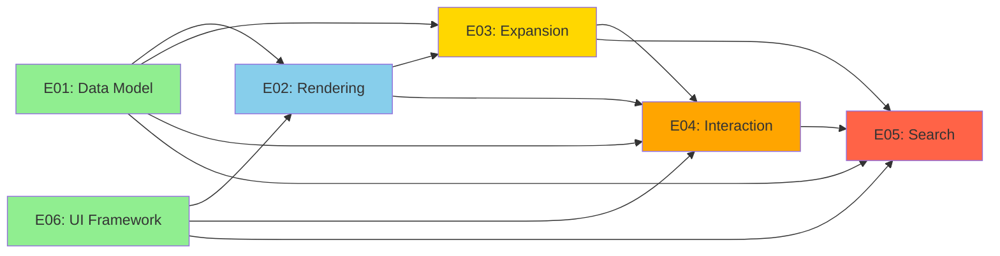
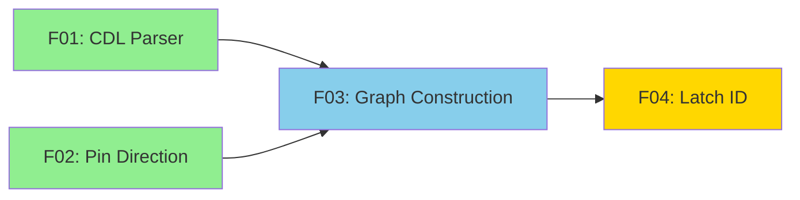
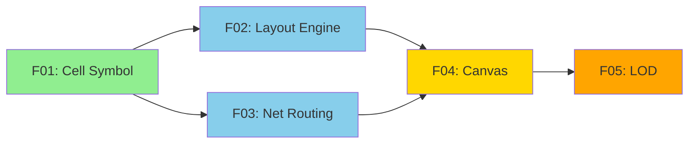
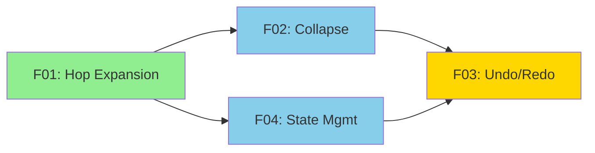
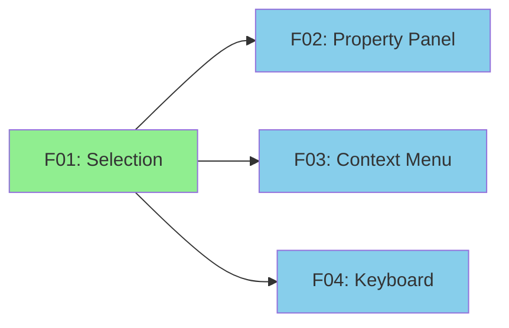
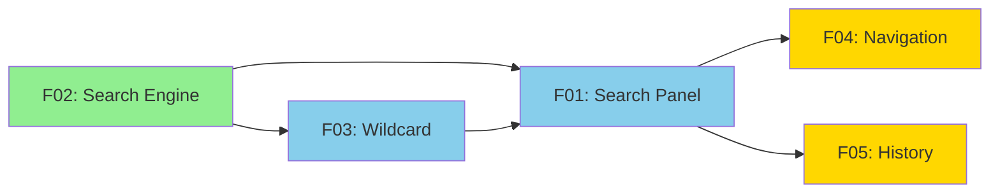
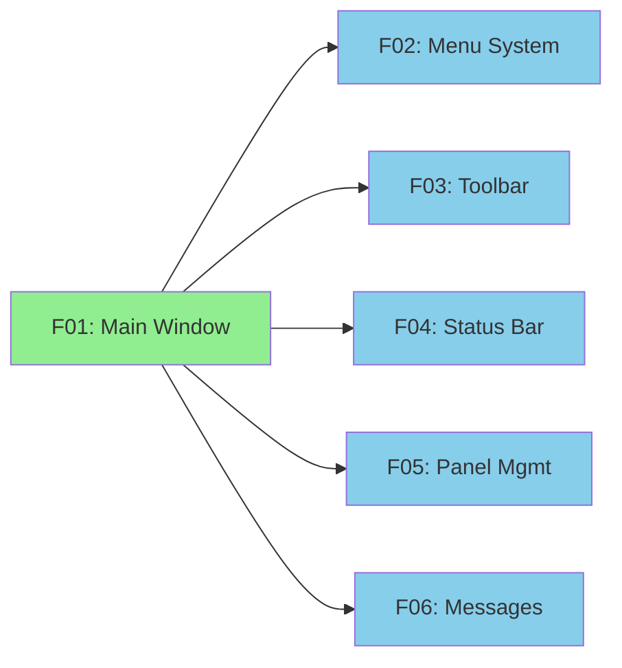

# Ink Project - Wave Parallelization Analysis

## Executive Summary

**Total Specs**: 138 (6 epics, 28 features, 104 tasks)
**Epic Waves**: 5
**Maximum Parallelism**: 2 epics in Wave 1, up to 4 features per epic

---

## Epic-Level Dependency Graph



---

## Epic Wave Breakdown

### Wave 1: Foundation Layer [P]
**Can Run in Parallel: YES**

| Epic | Title | Features | Tasks | Est. Hours |
|------|-------|----------|-------|------------|
| E01 | Input Parsing & Data Model | 4 | 15 | ~40h |
| E06 | UI Framework | 6 | 24 | ~50h |

**Rationale**: Both epics have NO upstream dependencies.
- E01: Foundation data layer (parsing, graph construction)
- E06: Foundation UI layer (main window, menus, toolbars)

**Parallelization Opportunity**: 2 developers can work simultaneously.

---

### Wave 2: Rendering Layer
**Dependencies**: E01, E06

| Epic | Title | Features | Tasks | Est. Hours |
|------|-------|----------|-------|------------|
| E02 | Schematic Rendering | 5 | 19 | ~60h |

**Rationale**: Rendering needs the data model (E01) and UI shell (E06).

---

### Wave 3: Expansion Layer
**Dependencies**: E01, E02

| Epic | Title | Features | Tasks | Est. Hours |
|------|-------|----------|-------|------------|
| E03 | Incremental Expansion | 4 | 16 | ~45h |

**Rationale**: Expansion needs to traverse the graph (E01) and trigger visual updates (E02).

---

### Wave 4: Interaction Layer
**Dependencies**: E01, E02, E03

| Epic | Title | Features | Tasks | Est. Hours |
|------|-------|----------|-------|------------|
| E04 | User Interaction | 4 | 17 | ~40h |

**Rationale**: Interaction depends on rendering (E02) and expansion undo/redo (E03).

---

### Wave 5: Search Layer
**Dependencies**: E01, E03, E04

| Epic | Title | Features | Tasks | Est. Hours |
|------|-------|----------|-------|------------|
| E05 | Search & Navigation | 5 | 18 | ~45h |

**Rationale**: Search needs data model (E01), expansion (E03), and Ctrl+F integration (E04).

---

## Feature-Level Wave Analysis (Within Epics)

### E01: Input Parsing & Data Model



| Wave | Features | Parallel |
|------|----------|----------|
| 1 | F01 (CDL Parser), F02 (Pin Direction) | [P] YES |
| 2 | F03 (Graph Construction) | No |
| 3 | F04 (Latch Identification) | No |

---

### E02: Schematic Rendering



| Wave | Features | Parallel |
|------|----------|----------|
| 1 | F01 (Cell Symbol Rendering) | No |
| 2 | F02 (Layout Engine), F03 (Net Routing) | [P] YES |
| 3 | F04 (Canvas & Viewport) | No |
| 4 | F05 (Level of Detail) | No |

---

### E03: Incremental Expansion



| Wave | Features | Parallel |
|------|----------|----------|
| 1 | F01 (Hop Expansion) | No |
| 2 | F02 (Collapse), F04 (Expansion State) | [P] YES |
| 3 | F03 (Undo/Redo) | No |

---

### E04: User Interaction



| Wave | Features | Parallel |
|------|----------|----------|
| 1 | F01 (Selection System) | No |
| 2 | F02 (Property Panel), F03 (Context Menu), F04 (Keyboard) | [P] YES |

---

### E05: Search & Navigation



| Wave | Features | Parallel |
|------|----------|----------|
| 1 | F02 (Search Engine Backend) | No |
| 2 | F01 (Search Panel UI), F03 (Wildcard Search) | [P] YES |
| 3 | F04 (Navigation), F05 (Search History) | [P] YES |

---

### E06: UI Framework



| Wave | Features | Parallel |
|------|----------|----------|
| 1 | F01 (Main Window Shell) | No |
| 2 | F02-F06 (Menu, Toolbar, Status, Panels, Messages) | [P] YES (5 features!) |

---

## Implementation Strategy

### Phase 1: Foundation (Waves 1) - 2-3 weeks
**Parallel Teams:**
- Team A: E01 (Data Model) - CDL parser, graph construction
- Team B: E06 (UI Framework) - Main window, basic panels

### Phase 2: Visualization (Waves 2-3) - 3-4 weeks
**Sequential:**
- E02 (Rendering) - Cell symbols, layout, routing

### Phase 3: Core Features (Waves 3-4) - 3-4 weeks
**Sequential with some parallelism:**
- E03 (Expansion) - Hop-based expansion
- E04 (Interaction) - Selection, property panel

### Phase 4: Search & Polish (Wave 5) - 2-3 weeks
- E05 (Search) - Search engine, navigation

---

## Recommended Starting Order

### Immediate Start (Wave 1 - No Dependencies)

| Priority | Spec | Title | Est. Hours |
|----------|------|-------|------------|
| 1a [P] | E01-F01 | CDL Parser | 20h |
| 1a [P] | E01-F02 | Pin Direction Parser | 8h |
| 1b [P] | E06-F01 | Main Window Shell | 14h |

### After Wave 1 Completes

| Priority | Spec | Depends On | Title |
|----------|------|------------|-------|
| 2a | E01-F03 | E01-F01, F02 | Graph Construction |
| 2b | E06-F02-F06 | E06-F01 | Menu, Toolbar, etc. |
| 3 | E01-F04 | E01-F03 | Latch Identification |
| 4 | E02-F01 | E01 complete | Cell Symbol Rendering |

---

## Time Estimates

| Scenario | Duration | Notes |
|----------|----------|-------|
| Serial (1 developer) | ~280 hours | All specs done sequentially |
| 2 Parallel (Wave 1) | ~200 hours | E01 + E06 in parallel |
| 3-4 Parallel (Max) | ~150 hours | Aggressive parallelism |

**Recommendation**: Start with 2 parallel tracks (E01 + E06), then converge for integration.

---

## Next Steps

1. **Create worktrees for Wave 1**:
   ```bash
   /spec_work_worktree E01-F01 --create
   /spec_work_worktree E01-F02 --create
   /spec_work_worktree E06-F01 --create
   ```

2. **Sync to ClickUp**:
   ```bash
   yarn clickup:sync --spec=E01
   yarn clickup:sync --spec=E06
   ```

3. **Begin implementation**:
   ```bash
   /spec_work E01-F01-T01 --tdd --post-docs
   ```

---

## Appendix: Full Spec Count by Epic

| Epic | Features | Tasks | Total Specs |
|------|----------|-------|-------------|
| E01 | 4 | 15 | 19 |
| E02 | 5 | 19 | 24 |
| E03 | 4 | 16 | 20 |
| E04 | 4 | 17 | 21 |
| E05 | 5 | 18 | 23 |
| E06 | 6 | 24 | 30 |
| **Total** | **28** | **104** | **138** |

---

*Generated: 2025-12-26*
*Tool: /spec_work --analyze-waves*
